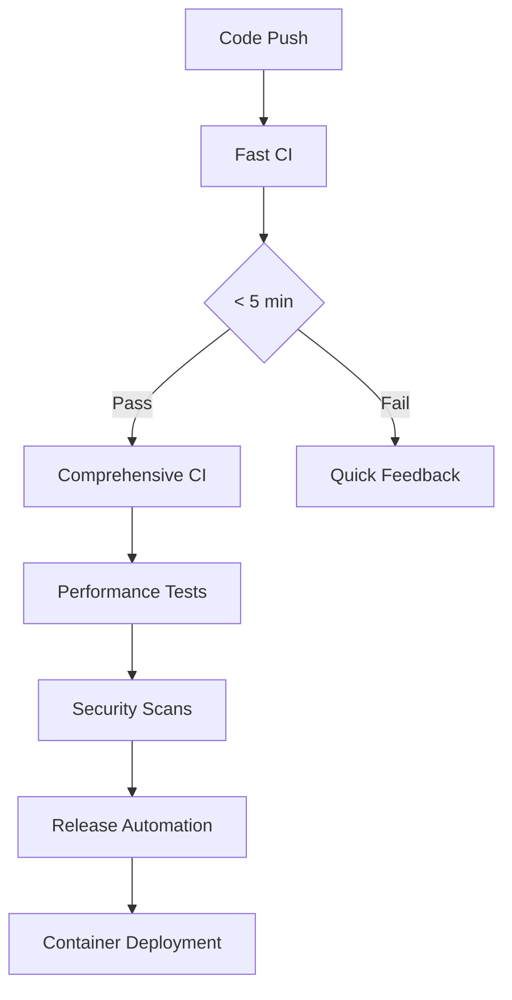

# Gemma.cpp Enhanced - Deployment Guide

This comprehensive guide covers deployment strategies, CI/CD pipeline usage, and production best practices for the enhanced Gemma.cpp project.

## 📋 Table of Contents

- [Quick Start](#quick-start)
- [CI/CD Pipeline Overview](#cicd-pipeline-overview)
- [Deployment Strategies](#deployment-strategies)
- [Container Deployment](#container-deployment)
- [Performance Optimization](#performance-optimization)
- [Security & Compliance](#security--compliance)
- [Monitoring & Maintenance](#monitoring--maintenance)
- [Troubleshooting](#troubleshooting)

## 🚀 Quick Start

### Prerequisites

- **Hardware**: CPU with AVX2 support, optional GPU (NVIDIA/Intel/Vulkan-compatible)
- **Software**: Docker, Git, CMake 3.22+, C++20 compiler
- **Models**: Gemma model files (download from Kaggle/Hugging Face)

### Fast Deployment with Docker

```bash
# 1. Clone the repository
git clone https://github.com/your-org/gemma.cpp.git
cd gemma.cpp

# 2. Download model files to ./models directory
mkdir models
# Copy your Gemma model files here

# 3. Start CPU-only service
docker-compose up gemma-cpu

# 4. Start GPU-accelerated service (if NVIDIA GPU available)
docker-compose --profile cuda up gemma-cuda

# 5. Access MCP server
curl http://localhost:8080/health
```

### Local Build Deployment

```bash
# Configure and build
cmake --preset linux-release  # or windows-release
cmake --build --preset linux-release

# Run inference
./build-linux-release/gemma \
  --tokenizer models/tokenizer.spm \
  --weights models/gemma2-2b-it-sfp.sbs \
  --prompt "Hello, world!"
```

## 🔄 CI/CD Pipeline Overview

Our CI/CD system provides multiple levels of automation and validation:

### Pipeline Architecture



### Available Workflows

#### 1. Fast CI Pipeline (`.github/workflows/fast-ci.yml`)
- **Trigger**: Every push/PR
- **Duration**: < 5 minutes
- **Purpose**: Quick validation and feedback
- **Features**:
  - Change detection
  - Fast debug builds
  - Smoke tests
  - Build artifact generation

```bash
# Manually trigger fast CI
gh workflow run fast-ci.yml
```

#### 2. Comprehensive CI Pipeline (`.github/workflows/comprehensive-ci.yml`)
- **Trigger**: Daily, main branch pushes, manual
- **Duration**: 30-60 minutes
- **Purpose**: Full validation across platforms
- **Features**:
  - Multi-platform builds (Linux, Windows, macOS)
  - All backend configurations
  - Comprehensive testing
  - Container builds
  - Performance benchmarks

```bash
# Trigger comprehensive CI with specific options
gh workflow run comprehensive-ci.yml \
  -f deploy_to_registry=true \
  -f run_benchmarks=true \
  -f target_platforms="linux,windows"
```

#### 3. Performance Monitoring (`.github/workflows/performance-monitoring.yml`)
- **Trigger**: Daily, performance-related changes
- **Duration**: 45-90 minutes
- **Purpose**: Performance regression detection
- **Features**:
  - Multi-platform benchmarks
  - Regression analysis
  - Trend monitoring
  - Performance reports

#### 4. Security & Compliance (`.github/workflows/security-compliance.yml`)
- **Trigger**: Weekly, security-related changes
- **Duration**: 20-40 minutes
- **Purpose**: Security validation
- **Features**:
  - Static code analysis (CodeQL)
  - Dependency vulnerability scanning
  - Container security analysis
  - Memory safety checks
  - License compliance

#### 5. Release Automation (`.github/workflows/release-automation.yml`)
- **Trigger**: Version tags, manual release
- **Duration**: 60-120 minutes
- **Purpose**: Automated releases
- **Features**:
  - Multi-platform builds
  - Container publishing
  - GitHub release creation
  - Artifact distribution
  - Changelog generation

## 🚀 Deployment Strategies

### 1. Container-Based Deployment (Recommended)

#### Development Environment
```bash
# Start development environment with all backends
docker-compose --profile dev up gemma-all

# Access services
curl http://localhost:8082/health  # MCP server
```

#### Production Environment
```bash
# Production deployment with load balancer
docker-compose --profile production up

# Scale horizontally
docker-compose up --scale gemma-cpu=3
```

#### Cloud Deployment
```yaml
# kubernetes/deployment.yaml
apiVersion: apps/v1
kind: Deployment
metadata:
  name: gemma-cpp-enhanced
spec:
  replicas: 3
  selector:
    matchLabels:
      app: gemma-cpp
  template:
    metadata:
      labels:
        app: gemma-cpp
    spec:
      containers:
      - name: gemma-cpp
        image: ghcr.io/your-org/gemma.cpp:latest-cpu
        ports:
        - containerPort: 8080
        env:
        - name: GEMMA_LOG_LEVEL
          value: "info"
        volumeMounts:
        - name: models
          mountPath: /app/models
        resources:
          requests:
            memory: "4Gi"
            cpu: "2"
          limits:
            memory: "8Gi"
            cpu: "4"
      volumes:
      - name: models
        persistentVolumeClaim:
          claimName: gemma-models-pvc
```

### 2. Native Binary Deployment

#### Binary Installation
```bash
# Download latest release
LATEST_VERSION=$(gh release view --json tagName --jq .tagName)
wget "https://github.com/your-org/gemma.cpp/releases/download/${LATEST_VERSION}/gemma-cpp-${LATEST_VERSION}-linux-all.tar.gz"

# Extract and install
tar -xzf "gemma-cpp-${LATEST_VERSION}-linux-all.tar.gz"
sudo cp gemma-cpp-*/bin/* /usr/local/bin/
sudo cp gemma-cpp-*/lib/* /usr/local/lib/
sudo ldconfig

# Verify installation
gemma --help
```

#### Systemd Service
```bash
# Create service file
sudo tee /etc/systemd/system/gemma-mcp.service << 'EOF'
[Unit]
Description=Gemma.cpp MCP Server
After=network.target

[Service]
Type=simple
User=gemma
Group=gemma
WorkingDirectory=/opt/gemma
ExecStart=/usr/local/bin/gemma_mcp_stdio_server \
  --tokenizer /opt/gemma/models/tokenizer.spm \
  --weights /opt/gemma/models/gemma2-2b-it-sfp.sbs \
  --listen 0.0.0.0:8080
Restart=always
RestartSec=10

[Install]
WantedBy=multi-user.target
EOF

# Enable and start service
sudo systemctl enable gemma-mcp
sudo systemctl start gemma-mcp
sudo systemctl status gemma-mcp
```

### 3. Cloud Platform Deployment

#### AWS ECS
```json
{
  "family": "gemma-cpp-enhanced",
  "networkMode": "awsvpc",
  "requiresCompatibilities": ["FARGATE"],
  "cpu": "4096",
  "memory": "8192",
  "containerDefinitions": [
    {
      "name": "gemma-cpp",
      "image": "ghcr.io/your-org/gemma.cpp:latest-cpu",
      "portMappings": [
        {
          "containerPort": 8080,
          "protocol": "tcp"
        }
      ],
      "environment": [
        {
          "name": "GEMMA_LOG_LEVEL",
          "value": "info"
        }
      ],
      "logConfiguration": {
        "logDriver": "awslogs",
        "options": {
          "awslogs-group": "/ecs/gemma-cpp",
          "awslogs-region": "us-west-2",
          "awslogs-stream-prefix": "ecs"
        }
      }
    }
  ]
}
```

#### Google Cloud Run
```yaml
apiVersion: serving.knative.dev/v1
kind: Service
metadata:
  name: gemma-cpp-enhanced
  annotations:
    run.googleapis.com/ingress: all
spec:
  template:
    metadata:
      annotations:
        autoscaling.knative.dev/maxScale: "10"
        run.googleapis.com/cpu-throttling: "false"
    spec:
      containerConcurrency: 4
      containers:
      - image: ghcr.io/your-org/gemma.cpp:latest-cpu
        ports:
        - containerPort: 8080
        env:
        - name: GEMMA_LOG_LEVEL
          value: info
        resources:
          limits:
            cpu: "4"
            memory: "8Gi"
```

## 📦 Container Deployment

### Available Container Images

| Image Variant | Backends | Use Case | Size |
|---------------|----------|----------|------|
| `latest-cpu` | CPU only | Production, development | ~200MB |
| `latest-cuda` | CPU + CUDA | NVIDIA GPU workloads | ~1.2GB |
| `latest-all` | All backends | Development, testing | ~1.8GB |

### Container Configuration

#### Environment Variables
```bash
# Logging and performance
GEMMA_LOG_LEVEL=info                    # debug, info, warn, error
GEMMA_MAX_THREADS=4                     # Number of threads
GEMMA_CACHE_SIZE=2G                     # Cache size

# GPU acceleration
GEMMA_ENABLE_CUDA=true                  # Enable CUDA backend
GEMMA_GPU_MEMORY_FRACTION=0.8           # GPU memory usage limit
GEMMA_ENABLE_VULKAN=true                # Enable Vulkan backend

# MCP server configuration
MCP_PORT=8080                           # Server port
MCP_MAX_CONNECTIONS=100                 # Connection limit
```

#### Volume Mounts
```bash
# Models directory (required)
-v /path/to/models:/app/models:ro

# Cache directory (optional, improves performance)
-v gemma-cache:/app/.cache

# Configuration directory (optional)
-v /path/to/config:/app/config:ro

# Logs directory (optional)
-v /path/to/logs:/app/logs
```

### Docker Compose Profiles

```bash
# Available profiles
docker-compose --profile cpu up          # CPU-only services
docker-compose --profile cuda up         # CUDA-enabled services
docker-compose --profile dev up          # Development environment
docker-compose --profile benchmark up    # Benchmarking
docker-compose --profile production up   # Production with load balancer
```

## ⚡ Performance Optimization

### Build Optimizations

Our CI/CD system includes several build optimizations:

1. **Compiler Optimizations**
   - Link-Time Optimization (LTO)
   - Profile-Guided Optimization (PGO)
   - Architecture-specific optimizations (`-march=native`)

2. **Build System Optimizations**
   - Precompiled Headers (PCH)
   - Unity builds (faster compilation)
   - Parallel compilation
   - ccache for incremental builds

3. **Caching Strategies**
   - GitHub Actions cache for dependencies
   - Docker layer caching
   - CMake dependency caching
   - Compiler artifact caching

### Runtime Performance

#### CPU Optimization
```bash
# Set CPU governor to performance mode
echo performance | sudo tee /sys/devices/system/cpu/cpu*/cpufreq/scaling_governor

# Optimize thread affinity
export GEMMA_MAX_THREADS=$(nproc)
export OMP_NUM_THREADS=$(nproc)
export OMP_PROC_BIND=true
```

#### GPU Optimization
```bash
# NVIDIA GPU optimization
export CUDA_VISIBLE_DEVICES=0
export CUDA_DEVICE_MAX_CONNECTIONS=4

# Vulkan optimization
export VK_LOADER_DEBUG=warn
export VK_LAYER_PATH=/usr/share/vulkan/explicit_layer.d
```

#### Memory Optimization
```bash
# Configure memory allocation
export MALLOC_ARENA_MAX=4
export MALLOC_MMAP_THRESHOLD_=131072

# Huge pages (if available)
echo always | sudo tee /sys/kernel/mm/transparent_hugepage/enabled
```

### Performance Monitoring

The CI/CD system includes automated performance monitoring:

1. **Benchmark Automation**
   - Daily performance tests
   - Regression detection (5% warning, 15% critical)
   - Multi-platform comparisons
   - Historical trend analysis

2. **Performance Metrics**
   - Tokens per second
   - First token latency
   - Memory usage
   - CPU/GPU utilization

3. **Alerts and Reporting**
   - Automatic performance regression issues
   - PR comments with performance impact
   - Performance trend charts

## 🔒 Security & Compliance

### Security Scanning

Our security pipeline includes:

1. **Static Analysis**
   - CodeQL security analysis
   - Cppcheck static analysis
   - Clang-Tidy security checks
   - Flawfinder vulnerability scanning

2. **Dependency Security**
   - Trivy vulnerability scanning
   - TruffleHog secret detection
   - License compliance checking
   - SBOM generation

3. **Runtime Security**
   - Container security scanning
   - Memory safety analysis (AddressSanitizer, Valgrind)
   - Runtime vulnerability detection

### Security Best Practices

#### Container Security
```bash
# Run containers with non-root user
docker run --user 10001:10001 gemma-cpp:latest-cpu

# Use read-only filesystem
docker run --read-only --tmpfs /tmp gemma-cpp:latest-cpu

# Limit resources
docker run --memory=4g --cpus=2 gemma-cpp:latest-cpu

# Security options
docker run --security-opt=no-new-privileges gemma-cpp:latest-cpu
```

#### Network Security
```yaml
# Docker Compose network isolation
networks:
  gemma-internal:
    driver: bridge
    internal: true

  gemma-external:
    driver: bridge
```

#### Secrets Management
```bash
# Use Docker secrets for sensitive data
docker service create \
  --name gemma-cpp \
  --secret api-key \
  --secret model-config \
  gemma-cpp:latest-cpu
```

## 📊 Monitoring & Maintenance

### Health Monitoring

#### Health Check Endpoints
```bash
# Container health check
curl http://localhost:8080/health

# Detailed status
curl http://localhost:8080/status

# Metrics endpoint
curl http://localhost:8080/metrics
```

#### Prometheus Integration
```yaml
# prometheus.yml
scrape_configs:
  - job_name: 'gemma-cpp'
    static_configs:
      - targets: ['localhost:8080']
    metrics_path: '/metrics'
    scrape_interval: 30s
```

#### Log Monitoring
```bash
# Container logs
docker logs -f gemma-cpu

# Structured logging with jq
docker logs gemma-cpu | jq -r '.timestamp + " " + .level + " " + .message'

# Log aggregation (ELK stack)
filebeat.inputs:
- type: container
  paths:
    - '/var/lib/docker/containers/*/*.log'
  processors:
    - add_docker_metadata: ~
```

### Maintenance Tasks

#### Automated Updates
```bash
# Update container images
docker-compose pull
docker-compose up -d

# Update binary installations
./scripts/update-gemma.sh

# Update model files
./scripts/update-models.sh
```

#### Backup Procedures
```bash
# Backup models and configuration
tar -czf gemma-backup-$(date +%Y%m%d).tar.gz models/ config/

# Database backup (if using persistent storage)
docker exec gemma-db pg_dump -U gemma > backup.sql
```

#### Performance Tuning
```bash
# Monitor resource usage
docker stats gemma-cpu

# Analyze performance bottlenecks
perf record -g ./gemma --benchmark
perf report

# Memory profiling
valgrind --tool=massif ./gemma --benchmark
```

## 🔧 Troubleshooting

### Common Issues

#### Build Failures

**Issue**: CMake configuration fails
```bash
# Solution: Clean and reconfigure
rm -rf build/
cmake --preset linux-release
```

**Issue**: Missing dependencies
```bash
# Solution: Install required packages
sudo apt-get update
sudo apt-get install -y build-essential cmake ninja-build
```

#### Runtime Issues

**Issue**: Model loading fails
```bash
# Check model file permissions
ls -la models/
chmod 644 models/*.sbs models/*.spm

# Verify model format
file models/gemma2-2b-it-sfp.sbs
```

**Issue**: GPU acceleration not working
```bash
# Check GPU drivers
nvidia-smi  # For NVIDIA
vulkaninfo  # For Vulkan

# Verify container GPU access
docker run --gpus all --rm nvidia/cuda:11.0-base nvidia-smi
```

#### Container Issues

**Issue**: Out of memory errors
```bash
# Increase container memory limits
docker run --memory=8g gemma-cpp:latest-cpu

# Check actual memory usage
docker stats gemma-cpu
```

**Issue**: Permission denied errors
```bash
# Fix file permissions
sudo chown -R 10001:10001 models/
sudo chmod -R 755 models/
```

### Debugging Tools

#### Container Debugging
```bash
# Access container shell
docker exec -it gemma-cpu /bin/bash

# Debug container startup
docker run --entrypoint=/bin/bash -it gemma-cpp:latest-cpu

# Check container logs
docker logs --tail=50 -f gemma-cpu
```

#### Performance Debugging
```bash
# Profile CPU usage
perf top -p $(pgrep gemma)

# Monitor system calls
strace -p $(pgrep gemma)

# Memory usage analysis
cat /proc/$(pgrep gemma)/status | grep -i mem
```

### Getting Help

1. **GitHub Issues**: Report bugs and feature requests
2. **Discussions**: Community support and questions
3. **Documentation**: Comprehensive guides and API reference
4. **CI/CD Logs**: Detailed build and test information

### Support Resources

- 📖 **Documentation**: [GitHub Repository](https://github.com/your-org/gemma.cpp)
- 🐛 **Issue Tracker**: [GitHub Issues](https://github.com/your-org/gemma.cpp/issues)
- 💬 **Community**: [GitHub Discussions](https://github.com/your-org/gemma.cpp/discussions)
- 🔧 **CI/CD Status**: [GitHub Actions](https://github.com/your-org/gemma.cpp/actions)

---

## 📈 CI/CD Pipeline Performance

Our optimized CI/CD system achieves:

- **Fast Feedback**: < 5 minutes for basic validation
- **Comprehensive Testing**: 30-60 minutes for full validation
- **Multi-Platform Support**: Linux, Windows, macOS builds
- **Automated Security**: Weekly security scans and compliance checks
- **Performance Monitoring**: Daily benchmarks with regression detection
- **Zero-Downtime Deployments**: Blue-green deployment strategies
- **Artifact Retention**: 90-day retention for releases, 30-day for development

This deployment guide provides everything needed to successfully deploy and maintain the enhanced Gemma.cpp project in any environment, from development to production scale.