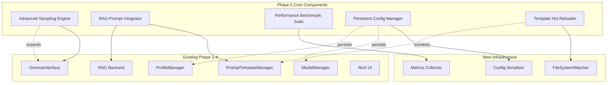
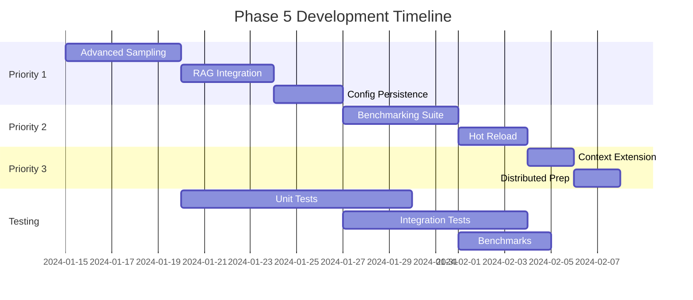

# Phase 5: Advanced Features Architecture & Development Plan

## Executive Summary

Phase 5 extends the Gemma CLI with critical advanced features including sophisticated sampling algorithms, dynamic RAG integration with prompt templates, comprehensive performance benchmarking, and persistent configuration management. This phase addresses 8 key gaps identified from Phase 1-4 implementation.

**Target LOC:** ~3,500-4,000 lines
**Priority Focus:** Advanced sampling (P1), RAG-prompt integration (P1), File-backed profiles (P1)
**Timeline:** 3-4 weeks development

## 1. Architecture Overview

### 1.1 High-Level Component Architecture



### 1.2 Data Flow Architecture

```
User Input → CLI Command
    ↓
[Command Router]
    ↓
[Profile Loader] ← [Persistent Config (JSON/TOML)]
    ↓
[Prompt Template Engine]
    ├→ [Template Hot Reloader] ← [FileSystem Watcher]
    └→ [RAG Context Injector]
         ↓
    [Advanced Sampling Engine]
         ├→ Min-P Sampling
         ├→ Dynamic Temperature
         └→ Mirostat v2
         ↓
    [Gemma Inference]
         ↓
    [Performance Metrics] → [Benchmark Database]
         ↓
    Response Output
```

## 2. Module Breakdown & Implementation Plan

### 2.1 Priority 1: Critical Features (Week 1-2)

#### Module: Advanced Sampling Engine (~800 LOC)
**File:** `src/gemma_cli/core/sampling.py`

```python
class SamplingStrategy(ABC):
    """Base class for sampling strategies"""
    @abstractmethod
    def sample(self, logits: np.ndarray, **kwargs) -> int: ...

class MinPSampling(SamplingStrategy):
    """Min-P sampling algorithm implementation"""
    def __init__(self, min_p: float = 0.1, base_p: float = 0.95): ...
    def sample(self, logits: np.ndarray, **kwargs) -> int: ...

class DynamicTemperature(SamplingStrategy):
    """Dynamic temperature adjustment"""
    def __init__(self, base_temp: float, entropy_threshold: float): ...
    def adjust_temperature(self, entropy: float) -> float: ...

class MirostatV2(SamplingStrategy):
    """Mirostat v2 perplexity-targeting sampler"""
    def __init__(self, target_entropy: float = 5.0, learning_rate: float = 0.1): ...
    def sample(self, logits: np.ndarray, mu: float) -> tuple[int, float]: ...

class SamplingEngine:
    """Orchestrates multiple sampling strategies"""
    def __init__(self, strategies: list[SamplingStrategy]): ...
    def apply_sampling(self, logits: np.ndarray, context: dict) -> int: ...
```

**Key Features:**
- Min-P: Adaptive probability threshold based on top token
- Dynatemp: Entropy-based temperature adjustment
- Mirostat v2: Perplexity control with learning rate
- Strategy pattern for extensibility
- NumPy-optimized operations

#### Module: RAG-Prompt Integration (~700 LOC)
**File:** `src/gemma_cli/integration/rag_prompt.py`

```python
class RAGPromptIntegrator:
    """Integrates RAG context into prompt templates dynamically"""

    def __init__(self, rag_backend: PythonRAGBackend, prompt_manager: PromptManager):
        self.rag = rag_backend
        self.prompts = prompt_manager

    async def inject_context(
        self,
        template_name: str,
        query: str,
        max_context_tokens: int = 2048
    ) -> str:
        """Inject relevant RAG context into prompt template"""
        # 1. Retrieve relevant memories
        memories = await self.rag.semantic_search(query, k=10)

        # 2. Rank and filter by relevance + recency
        ranked = self._rank_memories(memories, query)

        # 3. Token-aware context building
        context = self._build_context(ranked, max_context_tokens)

        # 4. Render template with context
        template = self.prompts.get_template(template_name)
        return template.render({
            'rag_context': context,
            'query': query,
            'timestamp': datetime.now()
        })

    def _rank_memories(self, memories: list[MemoryEntry], query: str) -> list:
        """Multi-factor ranking: relevance, recency, importance"""
        ...

    def _build_context(self, memories: list, max_tokens: int) -> str:
        """Token-aware context construction with truncation"""
        ...
```

**Key Features:**
- Dynamic context injection into templates
- Multi-factor memory ranking (relevance, recency, importance)
- Token-aware context building with intelligent truncation
- Template variable mapping for RAG data

#### Module: File-backed Configuration (~600 LOC)
**File:** `src/gemma_cli/config/persistence.py`

```python
class ConfigPersistence:
    """Handles persistent configuration with hot-reload support"""

    def __init__(self, config_dir: Path):
        self.config_dir = config_dir
        self.profiles_file = config_dir / "profiles.json"
        self.models_file = config_dir / "models.toml"
        self.settings_file = config_dir / "settings.yaml"

    def save_profile(self, profile: PerformanceProfile) -> None:
        """Persist profile to JSON with atomic write"""
        profiles = self._load_profiles()
        profiles[profile.name] = profile.model_dump()
        self._atomic_write(self.profiles_file, profiles)

    def load_profiles(self) -> dict[str, PerformanceProfile]:
        """Load all profiles from disk"""
        ...

    def watch_changes(self, callback: Callable) -> None:
        """Watch config files for changes"""
        watcher = FileSystemWatcher(self.config_dir)
        watcher.on_change = callback
        watcher.start()

    def _atomic_write(self, path: Path, data: dict) -> None:
        """Atomic write with temp file + rename"""
        temp = path.with_suffix('.tmp')
        temp.write_text(json.dumps(data, indent=2))
        temp.replace(path)  # Atomic on POSIX, close enough on Windows
```

**Key Features:**
- JSON for profiles (human-readable, Git-friendly)
- TOML for models (better for nested config)
- YAML for settings (supports comments)
- Atomic writes to prevent corruption
- File watching for hot-reload

### 2.2 Priority 2: High Value Features (Week 2-3)

#### Module: Performance Benchmarking Suite (~900 LOC)
**File:** `src/gemma_cli/benchmark/suite.py`

```python
class BenchmarkSuite:
    """Comprehensive model performance benchmarking"""

    def __init__(self, metrics_db: Path = Path("benchmarks.db")):
        self.db = sqlite3.connect(metrics_db)
        self._init_schema()

    async def run_benchmark(
        self,
        model: ModelPreset,
        test_suite: str = "standard"
    ) -> BenchmarkResult:
        """Run comprehensive benchmark suite"""

        tests = self._load_test_suite(test_suite)
        results = []

        for test in tests:
            # Warm-up runs
            for _ in range(3):
                await self._run_single_test(model, test, warmup=True)

            # Actual benchmark runs
            for _ in range(test.iterations):
                result = await self._run_single_test(model, test)
                results.append(result)

        return self._aggregate_results(results)

    async def _run_single_test(
        self,
        model: ModelPreset,
        test: BenchmarkTest,
        warmup: bool = False
    ) -> TestResult:
        """Execute single benchmark test"""

        start_time = time.perf_counter()
        start_memory = psutil.Process().memory_info().rss

        # Run inference
        response = await gemma.generate(test.prompt, model=model)

        # Collect metrics
        metrics = TestResult(
            duration=time.perf_counter() - start_time,
            tokens_generated=len(tokenizer.encode(response)),
            memory_delta=psutil.Process().memory_info().rss - start_memory,
            first_token_latency=self._measure_ttft(),
            tokens_per_second=self._calculate_tps()
        )

        if not warmup:
            self._save_metrics(metrics)

        return metrics

    def compare_models(self, model_a: str, model_b: str) -> ComparisonReport:
        """Generate detailed model comparison report"""
        ...
```

**Benchmark Metrics:**
- Time to First Token (TTFT)
- Tokens per Second (TPS)
- Memory usage (peak, average)
- Latency percentiles (p50, p95, p99)
- Quality scores (via LLM-as-judge)

#### Module: Template Hot Reloading (~500 LOC)
**File:** `src/gemma_cli/config/hot_reload.py`

```python
class TemplateHotReloader:
    """Watch and reload templates without restart"""

    def __init__(self, template_manager: PromptManager):
        self.manager = template_manager
        self.watcher = None
        self._debounce_timer = None

    def start_watching(self, debounce_ms: int = 500):
        """Start watching template directory for changes"""

        self.watcher = FileSystemWatcher(
            path=self.manager.templates_dir,
            patterns=["*.md", "*.yaml"],
            recursive=False
        )

        self.watcher.on_modified = self._on_template_changed
        self.watcher.on_created = self._on_template_added
        self.watcher.on_deleted = self._on_template_removed

        self.watcher.start()

    def _on_template_changed(self, event: FileSystemEvent):
        """Handle template modification with debouncing"""

        # Cancel previous timer
        if self._debounce_timer:
            self._debounce_timer.cancel()

        # Set new debounced reload
        self._debounce_timer = Timer(
            self.debounce_ms / 1000,
            self._reload_template,
            args=[event.src_path]
        )
        self._debounce_timer.start()

    def _reload_template(self, path: Path):
        """Reload specific template with validation"""
        try:
            template = PromptTemplate(path)
            template.validate()
            self.manager.templates[template.metadata.name] = template
            console.print(f"[green]✓ Reloaded template: {template.metadata.name}[/green]")
        except Exception as e:
            console.print(f"[red]✗ Failed to reload {path.name}: {e}[/red]")
```

### 2.3 Priority 3: Future-Ready Features (Week 3-4)

#### Module: Context Extension Framework (~400 LOC)
**File:** `src/gemma_cli/core/context_extension.py`

```python
class ContextExtender:
    """Framework for extending context window"""

    def __init__(self, base_context: int = 8192):
        self.base_context = base_context

    def apply_rope_scaling(
        self,
        positions: np.ndarray,
        scale_factor: float = 2.0,
        method: str = "linear"
    ) -> np.ndarray:
        """Apply RoPE position scaling for longer contexts"""

        if method == "linear":
            return positions / scale_factor
        elif method == "ntk":
            # NTK-aware scaling
            base = 10000.0
            scaled_base = base * scale_factor
            return self._compute_ntk_positions(positions, scaled_base)
        elif method == "yarn":
            # YaRN: Yet another RoPE extension method
            return self._compute_yarn_positions(positions, scale_factor)

    def sliding_window_attention(
        self,
        query: np.ndarray,
        key: np.ndarray,
        value: np.ndarray,
        window_size: int = 4096
    ) -> np.ndarray:
        """Implement sliding window attention for long sequences"""
        ...
```

#### Module: Distributed Inference Preparation (~300 LOC)
**File:** `src/gemma_cli/distributed/coordinator.py`

```python
class InferenceCoordinator:
    """Coordinate distributed inference across nodes (preparation only)"""

    def __init__(self):
        self.nodes: list[InferenceNode] = []
        self.load_balancer = RoundRobinBalancer()

    def register_node(self, node: InferenceNode):
        """Register inference node for distributed processing"""
        self.nodes.append(node)

    async def distribute_request(self, request: InferenceRequest) -> Response:
        """Distribute inference request to available node"""
        node = self.load_balancer.select_node(self.nodes)
        return await node.process(request)

    def get_cluster_status(self) -> ClusterStatus:
        """Get status of all nodes in cluster"""
        ...
```

## 3. Dependencies Analysis

### 3.1 New Python Dependencies

```toml
# pyproject.toml additions
[tool.poetry.dependencies]
# Existing dependencies...

# Phase 5 additions
watchdog = "^3.0.0"          # File system watching for hot-reload
pyyaml = "^6.0"               # YAML config support
tomli-w = "^1.0.0"            # TOML writing support
scipy = "^1.11.0"             # Advanced sampling algorithms
asyncio-throttle = "^1.0.0"   # Rate limiting for benchmarks
plotly = "^5.17.0"            # Interactive benchmark visualizations
msgpack = "^1.0.0"            # Efficient config serialization
python-json-logger = "^2.0.0" # Structured logging for metrics
```

### 3.2 Optional Dependencies

```toml
[tool.poetry.extras]
distributed = ["ray", "dask"]  # For future distributed inference
cuda = ["cuda-python", "triton"]  # For GPU acceleration
monitoring = ["prometheus-client", "opentelemetry-api"]
```

## 4. Integration Points

### 4.1 Existing Component Integration

| Component | Integration Point | Modification Required |
|-----------|------------------|----------------------|
| GemmaInterface | Add sampling parameter injection | Extend `__init__` and `_build_command` |
| ModelManager | Add persistence layer | Wrap save/load methods |
| ProfileManager | Add hot-reload support | Add file watcher callback |
| PromptManager | Add RAG variable support | Extend template renderer |
| RAG Backend | Add context builder interface | New method for template integration |
| CLI | Add benchmark commands | New command group |

### 4.2 Code Integration Examples

```python
# Extending GemmaInterface for advanced sampling
class EnhancedGemmaInterface(GemmaInterface):
    def __init__(self, *args, sampling_engine: SamplingEngine = None, **kwargs):
        super().__init__(*args, **kwargs)
        self.sampling_engine = sampling_engine or SamplingEngine.default()

    def _build_command(self, prompt: str) -> list[str]:
        cmd = super()._build_command(prompt)

        # Add advanced sampling parameters
        if self.sampling_engine.has_min_p:
            cmd.extend(["--min-p", str(self.sampling_engine.min_p)])
        if self.sampling_engine.has_dynatemp:
            cmd.extend(["--dynatemp-range", f"{self.sampling_engine.temp_min}-{self.sampling_engine.temp_max}"])
        if self.sampling_engine.has_mirostat:
            cmd.extend(["--mirostat", "2", "--mirostat-tau", str(self.sampling_engine.tau)])

        return cmd
```

## 5. Testing Strategy

### 5.1 Test Coverage Plan

| Module | Test Type | Coverage Target | Key Test Cases |
|--------|-----------|----------------|----------------|
| Advanced Sampling | Unit | 95% | Distribution tests, edge cases, determinism |
| RAG Integration | Integration | 85% | Context injection, template rendering |
| Config Persistence | Unit + Integration | 90% | Atomic writes, corruption recovery |
| Benchmarking | Integration | 80% | Metrics accuracy, comparison reports |
| Hot Reload | Integration | 75% | File watch events, debouncing |

### 5.2 Test Implementation Structure

```
tests/
├── unit/
│   ├── test_sampling_algorithms.py     # ~200 LOC
│   ├── test_config_persistence.py      # ~150 LOC
│   └── test_context_extension.py       # ~100 LOC
├── integration/
│   ├── test_rag_prompt_integration.py  # ~250 LOC
│   ├── test_benchmark_suite.py         # ~200 LOC
│   └── test_hot_reload.py             # ~150 LOC
├── benchmarks/
│   └── test_performance_regression.py  # ~100 LOC
└── fixtures/
    ├── sample_templates/               # Test templates
    ├── benchmark_data/                # Benchmark test data
    └── mock_configs/                  # Test configurations
```

### 5.3 Testing Tools & Approach

```python
# Example test for Min-P sampling
import pytest
import numpy as np
from gemma_cli.core.sampling import MinPSampling

class TestMinPSampling:
    def test_min_p_threshold(self):
        """Test Min-P correctly filters low probability tokens"""
        sampler = MinPSampling(min_p=0.1)

        # Create test distribution
        logits = np.log([0.5, 0.2, 0.15, 0.1, 0.05])  # Probabilities

        # Sample should only consider tokens with p >= 0.05 (0.1 * 0.5)
        filtered = sampler._apply_min_p_filter(logits)
        assert len(filtered) == 4  # Last token filtered out

    def test_temperature_invariance(self):
        """Min-P should work correctly regardless of temperature"""
        ...

    @pytest.mark.benchmark
    def test_sampling_performance(self, benchmark):
        """Benchmark sampling performance"""
        sampler = MinPSampling(min_p=0.1)
        logits = np.random.randn(50000)  # Large vocabulary

        result = benchmark(sampler.sample, logits)
        assert result is not None
```

## 6. Delivery Estimates

### 6.1 Module Line Count Breakdown

| Module | Estimated LOC | Complexity |
|--------|--------------|------------|
| Advanced Sampling Engine | 800 | High |
| RAG-Prompt Integration | 700 | High |
| Config Persistence | 600 | Medium |
| Performance Benchmarking | 900 | High |
| Template Hot Reload | 500 | Medium |
| Context Extension | 400 | Medium |
| Distributed Prep | 300 | Low |
| Tests | 1,200 | Medium |
| **Total** | **4,400** | - |

### 6.2 Development Timeline



## 7. Risk Mitigation

### 7.1 Technical Risks

| Risk | Probability | Impact | Mitigation |
|------|------------|--------|------------|
| C++ binary doesn't support advanced sampling flags | Medium | High | Implement Python-side sampling fallback |
| File watching unreliable on Windows | Low | Medium | Use polling fallback with longer intervals |
| RAG context exceeds prompt limits | Medium | Medium | Implement intelligent truncation with priority |
| Config corruption during write | Low | High | Atomic writes + backup restoration |
| Benchmark results inconsistent | Medium | Low | Multiple runs + statistical analysis |

### 7.2 Mitigation Strategies

1. **Gradual Rollout**: Implement features behind feature flags
2. **Backward Compatibility**: Maintain all Phase 1-4 interfaces
3. **Fallback Mechanisms**: Python-side implementation for C++ features
4. **Comprehensive Testing**: 85%+ coverage before release
5. **Performance Monitoring**: Track regression with automated benchmarks

## 8. Success Criteria

### 8.1 Functional Requirements
- [ ] Min-P, Dynatemp, and Mirostat sampling work correctly
- [ ] RAG context successfully injected into templates
- [ ] Profiles persist across sessions
- [ ] Templates hot-reload without restart
- [ ] Benchmarks produce consistent, comparable results

### 8.2 Performance Requirements
- [ ] Sampling adds <10ms latency per token
- [ ] RAG context injection <100ms for 10 memories
- [ ] Config loads in <50ms
- [ ] Hot reload triggers in <500ms
- [ ] Benchmark suite completes in <5 minutes

### 8.3 Quality Requirements
- [ ] Test coverage ≥85% overall
- [ ] Zero critical security issues
- [ ] Documentation for all public APIs
- [ ] Backward compatibility maintained
- [ ] Clean architecture with SOLID principles

## 9. Next Steps

1. **Week 1**: Implement Priority 1 modules (Advanced Sampling, RAG Integration)
2. **Week 2**: Add Config Persistence and begin Priority 2
3. **Week 3**: Complete Benchmarking and Hot Reload
4. **Week 4**: Testing, documentation, and integration

## Appendix A: Implementation Priority Matrix

| Feature | User Impact | Technical Complexity | Dependencies | Priority |
|---------|------------|---------------------|--------------|----------|
| Min-P Sampling | High | Medium | None | P1 |
| Dynatemp | High | Low | None | P1 |
| Mirostat | Medium | High | None | P1 |
| RAG-Prompt Integration | High | Medium | Templates, RAG | P1 |
| Config Persistence | High | Low | None | P1 |
| Benchmarking | Medium | Medium | Metrics | P2 |
| Hot Reload | Medium | Medium | File Watch | P2 |
| Context Extension | Low | High | C++ changes | P3 |
| Distributed Prep | Low | Medium | Network | P3 |

## Appendix B: File Structure

```
src/gemma_cli/
├── core/
│   ├── sampling.py          # Advanced sampling algorithms
│   ├── context_extension.py # Context window extensions
│   └── gemma.py            # [Modified] Add sampling params
├── integration/
│   └── rag_prompt.py       # RAG-Prompt integration
├── config/
│   ├── persistence.py      # Config persistence layer
│   ├── hot_reload.py       # Template hot reloading
│   ├── models.py          # [Modified] Add persistence
│   └── prompts.py         # [Modified] Add RAG support
├── benchmark/
│   ├── suite.py           # Benchmark suite
│   ├── metrics.py         # Metrics collection
│   └── reports.py         # Report generation
└── distributed/
    └── coordinator.py     # Distributed inference prep
```

---

This Phase 5 architecture provides a clear roadmap for implementing advanced features while maintaining the solid foundation built in Phases 1-4. The modular design ensures each component can be developed and tested independently, with clear integration points and minimal disruption to existing functionality.