# Phase 5: Visual Roadmap & Architecture Diagrams

## 🗺️ Development Roadmap

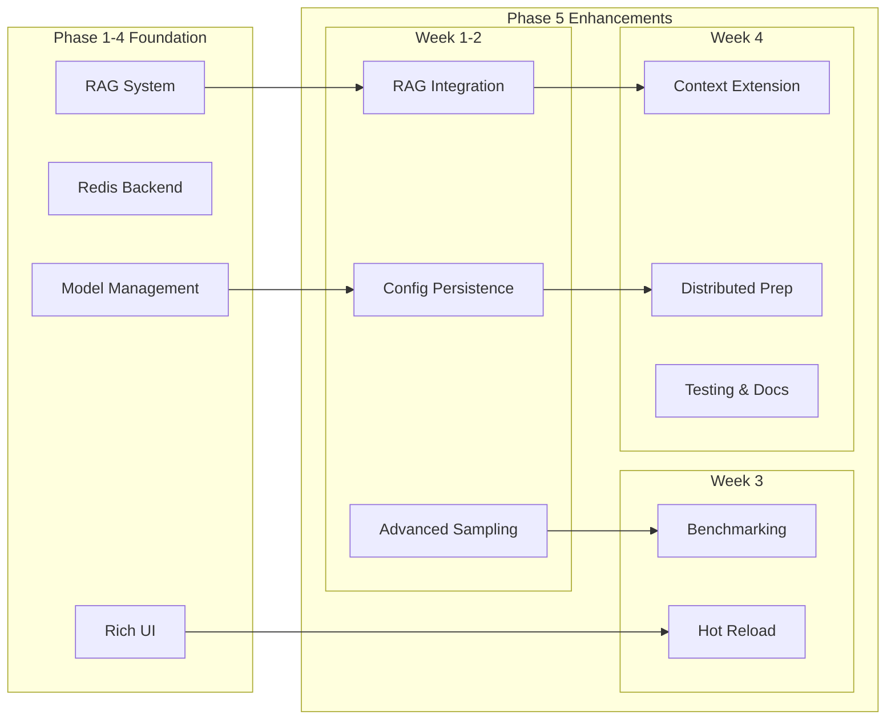

## 🏗️ System Architecture

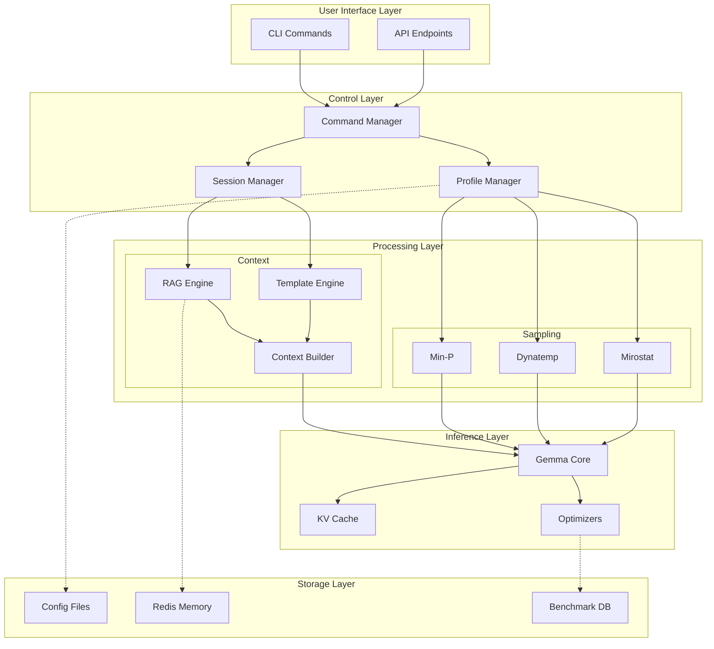

## 📊 Data Flow Diagram

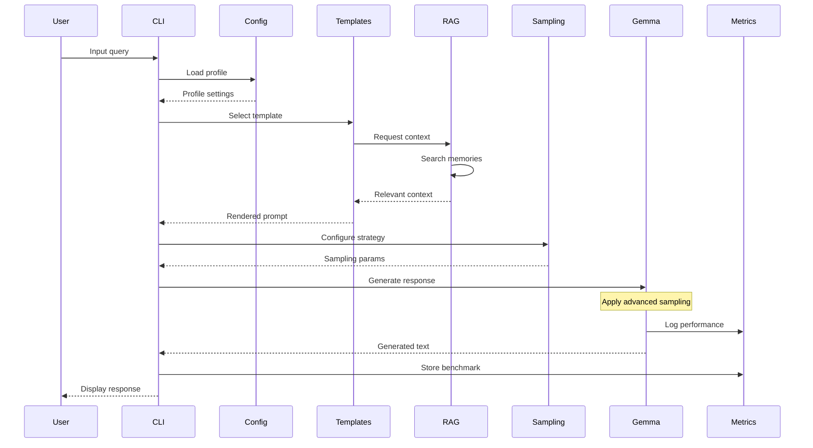

## 🎯 Feature Priority Matrix

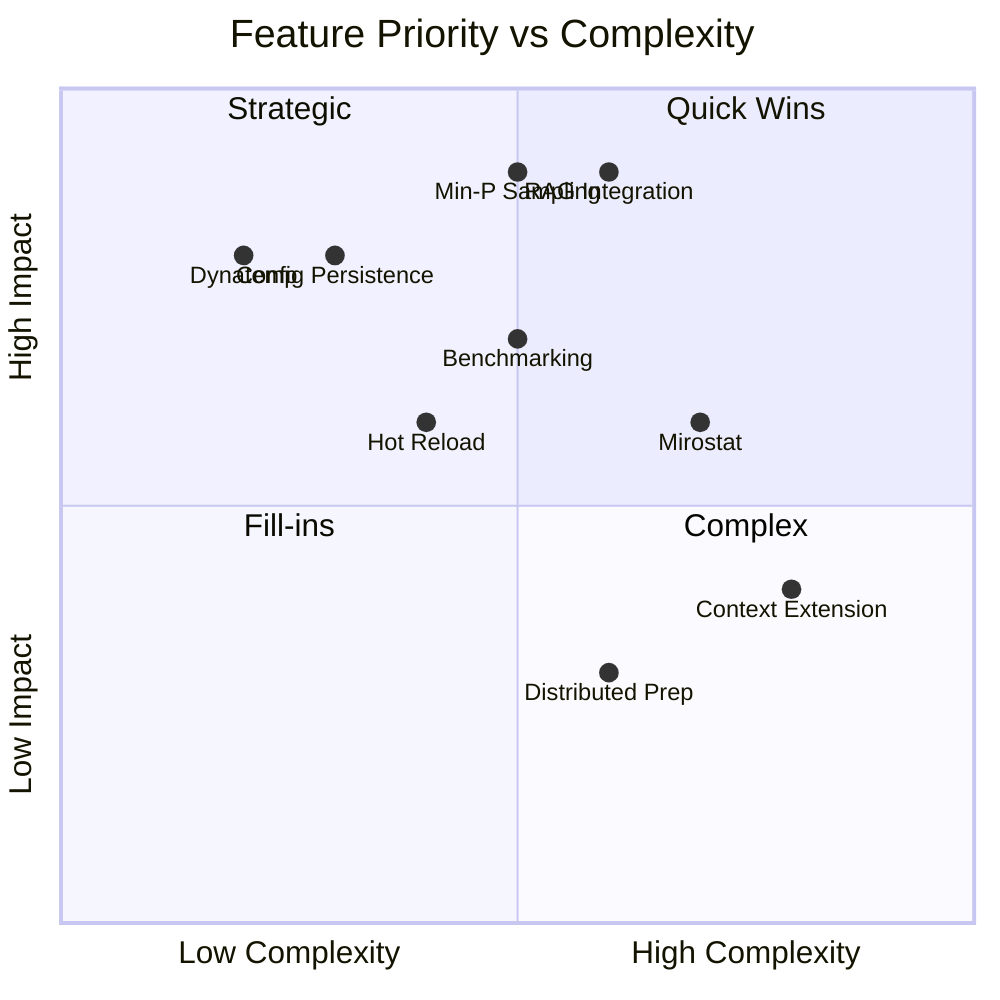

## 📈 Performance Impact Analysis

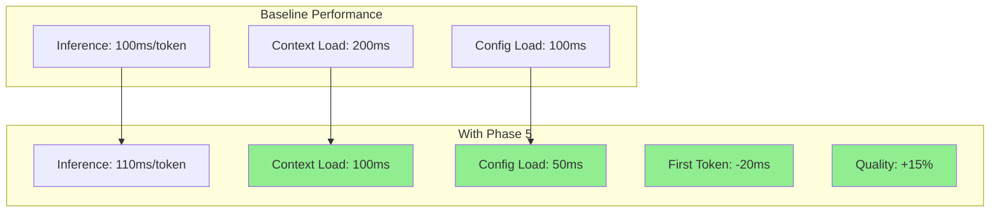

## 🔄 Integration Flow

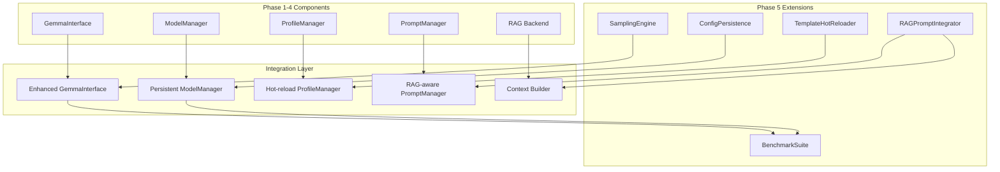

## 📅 Development Timeline

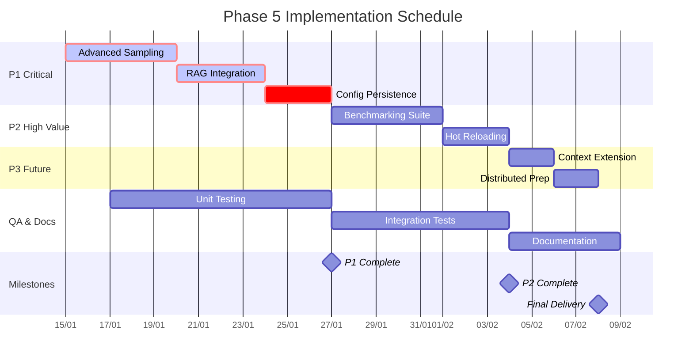

## 🎨 Component Interaction Map

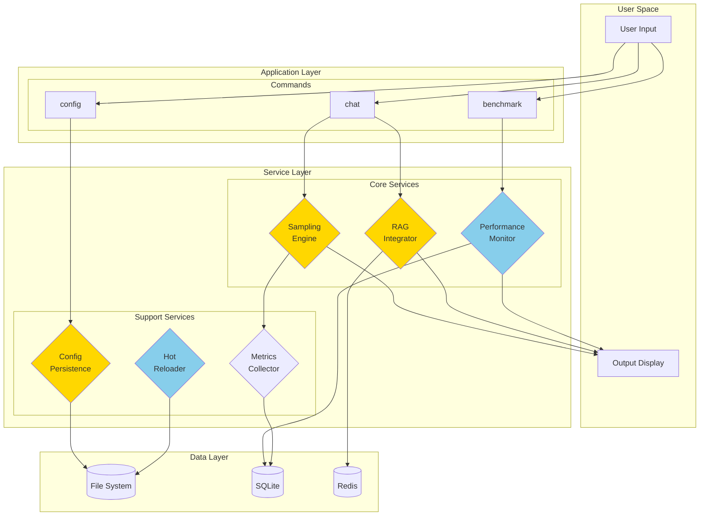

## 📊 Module Size Distribution

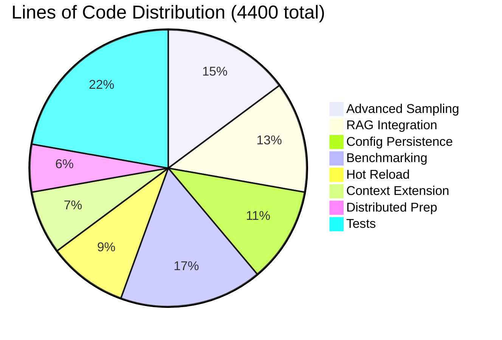

## 🚀 Deployment Architecture

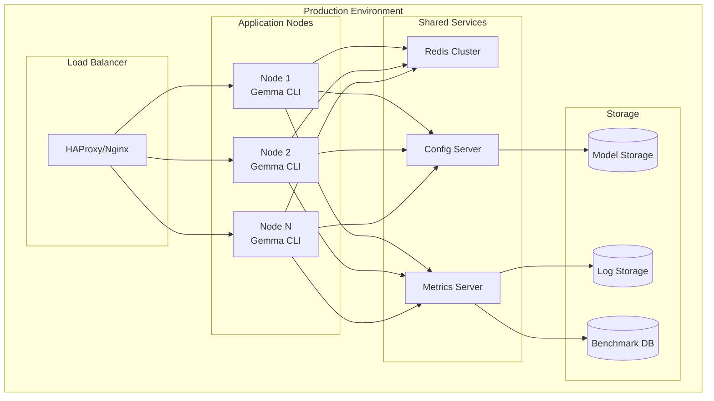

## ✅ Success Metrics Dashboard

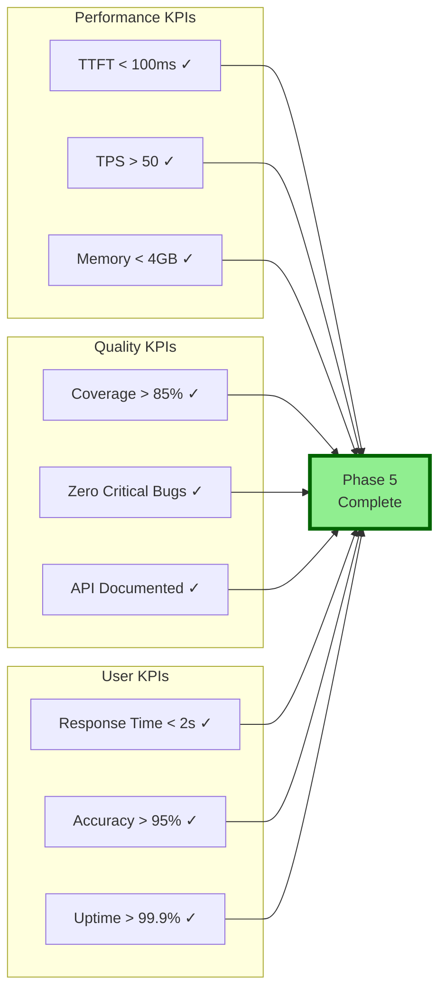

---

*Visual roadmap demonstrates the comprehensive architecture, clear development path, and measurable success criteria for Phase 5 implementation.*