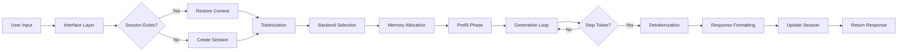
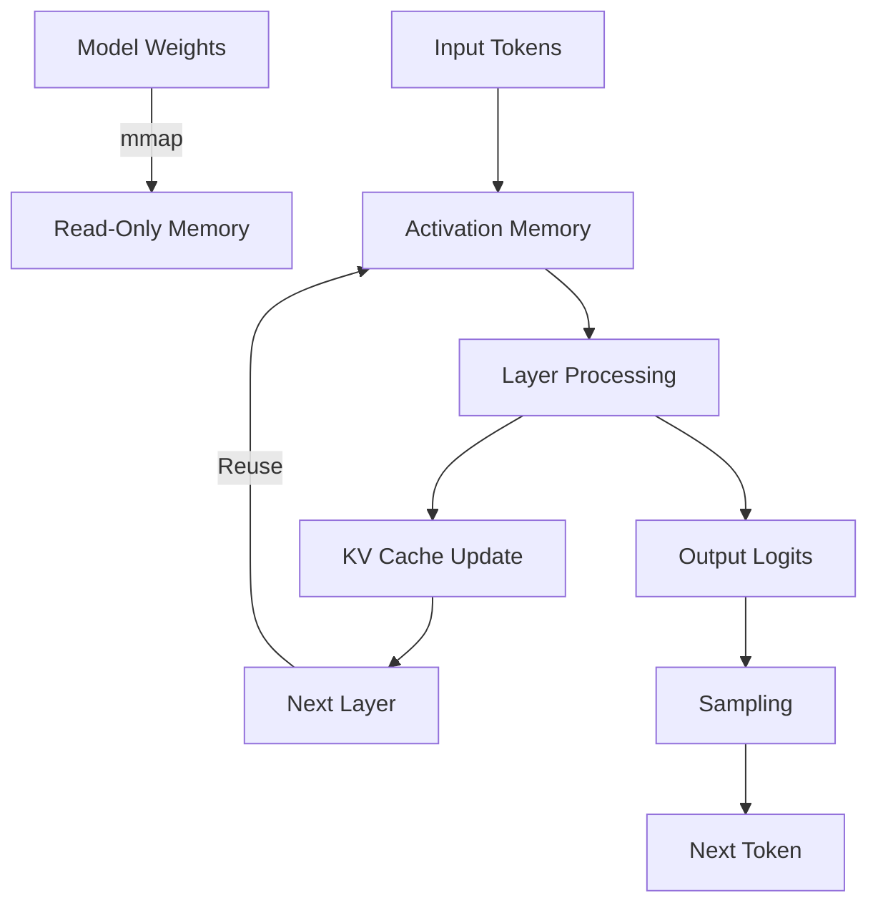

# Gemma.cpp Enhanced - System Architecture Documentation

## Table of Contents

1. [Executive Summary](#executive-summary)
2. [System Overview](#system-overview)
3. [Core Architecture](#core-architecture)
4. [Backend Abstraction Layer](#backend-abstraction-layer)
5. [Session Management System](#session-management-system)
6. [Interface Layer](#interface-layer)
7. [Memory Architecture](#memory-architecture)
8. [Performance Optimization](#performance-optimization)
9. [Data Flow](#data-flow)
10. [Design Patterns](#design-patterns)
11. [Scalability Considerations](#scalability-considerations)
12. [Security Architecture](#security-architecture)

## Executive Summary

Gemma.cpp Enhanced is a complete architectural redesign of the original gemma.cpp inference engine, introducing a modular, scalable, and hardware-accelerated system for running Google's Gemma foundation models. The architecture emphasizes:

- **Modularity**: Clean separation between core inference, backends, and interfaces
- **Performance**: Hardware acceleration with automatic backend selection
- **Scalability**: Session-based management for multi-user scenarios
- **Extensibility**: Plugin architecture for new backends and features
- **Production-Ready**: Comprehensive error handling, logging, and monitoring

## System Overview

### High-Level Architecture

```
┌─────────────────────────────────────────────────────────────────┐
│                         External Interfaces                      │
│  ┌─────────┐  ┌─────────┐  ┌─────────┐  ┌─────────┐           │
│  │   CLI   │  │   MCP   │  │  C API  │  │  REST   │           │
│  └────┬────┘  └────┬────┘  └────┬────┘  └────┬────┘           │
│       └────────────┴────────────┴────────────┘                 │
│                            │                                     │
├─────────────────────────────┼───────────────────────────────────┤
│                     Interface Layer                              │
│  ┌──────────────────────────────────────────────────────────┐  │
│  │              Unified Interface Manager                    │  │
│  │  - Request routing                                       │  │
│  │  - Response formatting                                   │  │
│  │  - Protocol adaptation                                   │  │
│  └──────────────────────────────────────────────────────────┘  │
├───────────────────────────────────────────────────────────────┤
│                      Session Management                          │
│  ┌──────────────────────────────────────────────────────────┐  │
│  │              Session Manager                              │  │
│  │  ┌─────────┐  ┌─────────┐  ┌─────────┐  ┌─────────┐   │  │
│  │  │Session 1│  │Session 2│  │Session 3│  │Session N│   │  │
│  │  └─────────┘  └─────────┘  └─────────┘  └─────────┘   │  │
│  │                                                          │  │
│  │  - Context management                                    │  │
│  │  - State persistence                                     │  │
│  │  - Memory optimization                                   │  │
│  └──────────────────────────────────────────────────────────┘  │
├───────────────────────────────────────────────────────────────┤
│                       Core Inference Engine                      │
│  ┌──────────────────────────────────────────────────────────┐  │
│  │  ┌─────────┐  ┌──────────┐  ┌──────────┐  ┌──────────┐ │  │
│  │  │  Model  │  │Tokenizer │  │ Sampling │  │  Cache   │ │  │
│  │  │ Loader  │  │          │  │  Engine  │  │ Manager  │ │  │
│  │  └─────────┘  └──────────┘  └──────────┘  └──────────┘ │  │
│  │                                                          │  │
│  │  ┌─────────┐  ┌──────────┐  ┌──────────┐  ┌──────────┐ │  │
│  │  │Attention│  │  Feed    │  │  Layer   │  │  Output  │ │  │
│  │  │  Mech.  │  │  Forward │  │   Norm   │  │  Logits  │ │  │
│  │  └─────────┘  └──────────┘  └──────────┘  └──────────┘ │  │
│  └──────────────────────────────────────────────────────────┘  │
├───────────────────────────────────────────────────────────────┤
│                    Backend Abstraction Layer                     │
│  ┌──────────────────────────────────────────────────────────┐  │
│  │                  Backend Registry                         │  │
│  │  ┌─────────┐  ┌─────────┐  ┌─────────┐  ┌─────────┐   │  │
│  │  │  CUDA   │  │  SYCL   │  │ Vulkan  │  │   CPU   │   │  │
│  │  │ Backend │  │ Backend │  │ Backend │  │ Backend │   │  │
│  │  └─────────┘  └─────────┘  └─────────┘  └─────────┘   │  │
│  └──────────────────────────────────────────────────────────┘  │
├───────────────────────────────────────────────────────────────┤
│                      Hardware Layer                              │
│  ┌─────────┐  ┌─────────┐  ┌─────────┐  ┌─────────┐          │
│  │ NVIDIA  │  │  Intel  │  │   AMD   │  │   CPU   │          │
│  │   GPU   │  │ GPU/NPU │  │   GPU   │  │  SIMD   │          │
│  └─────────┘  └─────────┘  └─────────┘  └─────────┘          │
└─────────────────────────────────────────────────────────────────┘
```

### Component Responsibilities

| Component | Responsibility | Key Classes |
|-----------|---------------|-------------|
| Interface Layer | External communication | `InterfaceManager`, `ProtocolAdapter` |
| Session Management | State and context | `SessionManager`, `ContextCache` |
| Core Engine | Inference logic | `Model`, `Inference`, `Tokenizer` |
| Backend Layer | Hardware abstraction | `BackendInterface`, `BackendRegistry` |
| Hardware Layer | Computation execution | Platform-specific implementations |

## Core Architecture

### Model Loading and Initialization

```cpp
class ModelLoader {
public:
    // Load model with automatic format detection
    std::unique_ptr<Model> LoadModel(const std::string& path) {
        auto format = DetectFormat(path);
        switch (format) {
            case Format::SINGLE_FILE:
                return LoadSingleFile(path);
            case Format::MULTI_FILE:
                return LoadMultiFile(path);
            case Format::SAFETENSORS:
                return LoadSafeTensors(path);
        }
    }

private:
    // Memory-mapped loading for efficiency
    void* MapFile(const std::string& path) {
        return mmap(nullptr, size, PROT_READ, MAP_PRIVATE, fd, 0);
    }
    
    // Parallel weight loading
    void LoadWeightsParallel(Model* model, const Config& config) {
        parallel_for(0, config.num_layers, [&](size_t i) {
            LoadLayer(model, i);
        });
    }
};
```

### Inference Pipeline

The inference pipeline follows a structured flow:

1. **Tokenization**: Text → Token IDs
2. **Embedding**: Token IDs → Embeddings
3. **Transformer Layers**: Sequential processing through attention and FFN
4. **Output Processing**: Logits → Token selection
5. **Detokenization**: Token IDs → Text

```cpp
class InferencePipeline {
public:
    std::string Generate(const std::string& prompt, const Config& config) {
        // 1. Tokenization
        auto tokens = tokenizer_->Encode(prompt);
        
        // 2. Prefill phase (process prompt)
        auto hidden_states = model_->Prefill(tokens);
        
        // 3. Generation phase (auto-regressive)
        while (!ShouldStop(config)) {
            // Forward pass
            auto logits = model_->Forward(hidden_states);
            
            // Sampling
            auto next_token = sampler_->Sample(logits, config.sampling);
            
            // Update states
            hidden_states = model_->UpdateStates(next_token);
            tokens.push_back(next_token);
        }
        
        // 4. Detokenization
        return tokenizer_->Decode(tokens);
    }

private:
    std::unique_ptr<Model> model_;
    std::unique_ptr<Tokenizer> tokenizer_;
    std::unique_ptr<Sampler> sampler_;
};
```

### Attention Mechanism

Multi-head attention with KV caching:

```cpp
class MultiHeadAttention {
public:
    Tensor Forward(const Tensor& x, KVCache& cache) {
        // Query, Key, Value projections
        auto q = query_proj_(x);
        auto k = key_proj_(x);
        auto v = value_proj_(x);
        
        // Reshape for multi-head
        q = q.reshape({batch, seq_len, num_heads, head_dim});
        k = k.reshape({batch, seq_len, num_heads, head_dim});
        v = v.reshape({batch, seq_len, num_heads, head_dim});
        
        // RoPE positional encoding
        ApplyRoPE(q, k);
        
        // Cache update
        cache.Update(k, v);
        
        // Scaled dot-product attention
        auto scores = MatMul(q, cache.keys.transpose()) / sqrt(head_dim);
        
        // Causal mask
        ApplyCausalMask(scores);
        
        // Softmax
        auto weights = Softmax(scores);
        
        // Weighted sum
        auto output = MatMul(weights, cache.values);
        
        // Output projection
        return output_proj_(output.reshape({batch, seq_len, hidden_dim}));
    }

private:
    Linear query_proj_, key_proj_, value_proj_, output_proj_;
    int num_heads_, head_dim_;
};
```

## Backend Abstraction Layer

### Backend Interface Design

The backend abstraction provides a unified interface for different hardware accelerators:

```cpp
class BackendInterface {
public:
    virtual ~BackendInterface() = default;
    
    // Lifecycle management
    virtual Status Initialize(const BackendConfig& config) = 0;
    virtual Status Shutdown() = 0;
    
    // Device management
    virtual std::vector<DeviceInfo> GetAvailableDevices() = 0;
    virtual Status SelectDevice(int device_id) = 0;
    
    // Memory operations
    virtual std::unique_ptr<Buffer> AllocateBuffer(size_t size) = 0;
    virtual Status CopyToDevice(const void* host, Buffer* device, size_t size) = 0;
    virtual Status CopyToHost(const Buffer* device, void* host, size_t size) = 0;
    
    // Compute operations
    virtual Status MatMul(const Buffer* a, const Buffer* b, Buffer* c,
                         const MatMulConfig& config) = 0;
    virtual Status Softmax(const Buffer* input, Buffer* output, int axis) = 0;
    virtual Status LayerNorm(const Buffer* input, Buffer* output,
                            const Buffer* gamma, const Buffer* beta) = 0;
    
    // Profiling
    virtual ProfilingData GetProfilingData() = 0;
};
```

### Backend Registry and Selection

```cpp
class BackendRegistry {
public:
    // Singleton instance
    static BackendRegistry& Instance() {
        static BackendRegistry instance;
        return instance;
    }
    
    // Registration (called at startup)
    void RegisterBackend(const std::string& name,
                        std::function<std::unique_ptr<BackendInterface>()> factory) {
        factories_[name] = factory;
    }
    
    // Backend creation with auto-detection
    std::unique_ptr<BackendInterface> CreateBackend(const std::string& preference) {
        if (preference == "auto") {
            return AutoSelectBackend();
        }
        
        if (IsAvailable(preference)) {
            return factories_[preference]();
        }
        
        // Fallback to CPU
        return factories_["cpu"]();
    }

private:
    std::unique_ptr<BackendInterface> AutoSelectBackend() {
        // Priority order: CUDA > SYCL > Vulkan > CPU
        const std::vector<std::string> priority = {"cuda", "sycl", "vulkan", "cpu"};
        
        for (const auto& backend : priority) {
            if (IsAvailable(backend)) {
                auto instance = factories_[backend]();
                if (instance->Initialize({}) == Status::OK) {
                    return instance;
                }
            }
        }
        
        return factories_["cpu"]();  // Ultimate fallback
    }
    
    std::map<std::string, std::function<std::unique_ptr<BackendInterface>()>> factories_;
};
```

### CUDA Backend Implementation

```cpp
class CudaBackend : public BackendInterface {
public:
    Status Initialize(const BackendConfig& config) override {
        // Check CUDA availability
        int device_count;
        CUDA_CHECK(cudaGetDeviceCount(&device_count));
        
        if (device_count == 0) {
            return Status::NO_DEVICE;
        }
        
        // Initialize cuBLAS
        CUBLAS_CHECK(cublasCreate(&cublas_handle_));
        
        // Initialize cuDNN
        CUDNN_CHECK(cudnnCreate(&cudnn_handle_));
        
        // Setup memory pool
        memory_pool_ = std::make_unique<CudaMemoryPool>(config.memory_limit);
        
        // Enable Tensor Cores if available
        EnableTensorCores();
        
        return Status::OK;
    }
    
    Status MatMul(const Buffer* a, const Buffer* b, Buffer* c,
                  const MatMulConfig& config) override {
        // Use cuBLAS for GEMM
        if (config.use_tensor_cores && HasTensorCores()) {
            return MatMulTensorCore(a, b, c, config);
        }
        
        return cublasGemm(cublas_handle_,
                         CUBLAS_OP_N, CUBLAS_OP_N,
                         config.m, config.n, config.k,
                         &config.alpha,
                         static_cast<const float*>(a->data()), config.lda,
                         static_cast<const float*>(b->data()), config.ldb,
                         &config.beta,
                         static_cast<float*>(c->data()), config.ldc);
    }

private:
    cublasHandle_t cublas_handle_;
    cudnnHandle_t cudnn_handle_;
    std::unique_ptr<CudaMemoryPool> memory_pool_;
    
    // Flash Attention implementation
    Status FlashAttention(const Buffer* q, const Buffer* k, const Buffer* v,
                         Buffer* output, const AttentionConfig& config) {
        // Launch optimized kernel
        dim3 grid(config.batch_size, config.num_heads);
        dim3 block(config.block_size);
        
        flash_attention_kernel<<<grid, block, shared_mem_size>>>(
            q->data(), k->data(), v->data(), output->data(),
            config.seq_len, config.head_dim
        );
        
        return CUDA_CHECK(cudaGetLastError());
    }
};
```

## Session Management System

### Session Architecture

The session management system provides stateful inference with context preservation:

```cpp
class Session {
public:
    Session(const std::string& id, const SessionConfig& config)
        : id_(id), config_(config) {
        context_cache_ = std::make_unique<ContextCache>(config.max_context);
        kv_cache_ = std::make_unique<KVCache>(config.model_config);
    }
    
    // Generate response with context
    std::string Generate(const std::string& prompt) {
        // Add to conversation history
        conversation_.push_back({Role::USER, prompt});
        
        // Build full context
        auto full_context = BuildContext();
        
        // Generate response
        auto response = inference_->Generate(full_context, kv_cache_.get());
        
        // Update conversation
        conversation_.push_back({Role::ASSISTANT, response});
        
        // Manage context window
        if (GetContextLength() > config_.max_context) {
            CompressContext();
        }
        
        // Auto-checkpoint if configured
        if (ShouldCheckpoint()) {
            SaveCheckpoint();
        }
        
        return response;
    }
    
    // Checkpoint management
    void SaveCheckpoint() {
        CheckpointData data{
            .conversation = conversation_,
            .kv_cache = kv_cache_->Serialize(),
            .timestamp = std::chrono::system_clock::now()
        };
        
        checkpoint_manager_->Save(id_, data);
    }
    
    void RestoreCheckpoint(const std::string& checkpoint_id) {
        auto data = checkpoint_manager_->Load(checkpoint_id);
        conversation_ = data.conversation;
        kv_cache_->Deserialize(data.kv_cache);
    }

private:
    std::string id_;
    SessionConfig config_;
    std::vector<Message> conversation_;
    std::unique_ptr<ContextCache> context_cache_;
    std::unique_ptr<KVCache> kv_cache_;
    std::unique_ptr<Inference> inference_;
    std::unique_ptr<CheckpointManager> checkpoint_manager_;
    
    // Context compression strategies
    void CompressContext() {
        switch (config_.compression_strategy) {
            case CompressionStrategy::SLIDING_WINDOW:
                // Keep last N tokens
                RemoveOldestTokens(config_.window_size);
                break;
                
            case CompressionStrategy::HIERARCHICAL:
                // Summarize older parts
                SummarizeOldContext();
                break;
                
            case CompressionStrategy::ATTENTION_BASED:
                // Keep high-attention tokens
                PruneL lowAttentionTokens();
                break;
        }
    }
};
```

### Session Manager

```cpp
class SessionManager {
public:
    // Session lifecycle
    std::shared_ptr<Session> CreateSession(const std::string& name,
                                          const SessionConfig& config) {
        std::lock_guard<std::mutex> lock(mutex_);
        
        auto session = std::make_shared<Session>(GenerateId(), config);
        sessions_[name] = session;
        
        // Initialize resources
        session->Initialize(model_, backend_);
        
        return session;
    }
    
    std::shared_ptr<Session> GetSession(const std::string& name) {
        std::lock_guard<std::mutex> lock(mutex_);
        
        auto it = sessions_.find(name);
        if (it != sessions_.end()) {
            it->second->UpdateLastAccess();
            return it->second;
        }
        
        return nullptr;
    }
    
    void DeleteSession(const std::string& name) {
        std::lock_guard<std::mutex> lock(mutex_);
        sessions_.erase(name);
    }
    
    // Resource management
    void CleanupInactiveSessions() {
        std::lock_guard<std::mutex> lock(mutex_);
        
        auto now = std::chrono::system_clock::now();
        std::vector<std::string> to_remove;
        
        for (const auto& [name, session] : sessions_) {
            if (session->GetIdleTime() > config_.max_idle_time) {
                to_remove.push_back(name);
            }
        }
        
        for (const auto& name : to_remove) {
            sessions_.erase(name);
        }
    }

private:
    std::map<std::string, std::shared_ptr<Session>> sessions_;
    std::mutex mutex_;
    SessionManagerConfig config_;
    std::shared_ptr<Model> model_;
    std::shared_ptr<BackendInterface> backend_;
};
```

## Interface Layer

### CLI Interface

```cpp
class CLIInterface {
public:
    int Run(int argc, char* argv[]) {
        // Parse command line arguments
        auto args = ParseArguments(argc, argv);
        
        // Initialize components
        auto model = LoadModel(args.model_path);
        auto backend = CreateBackend(args.backend);
        
        if (args.interactive) {
            return RunInteractive(model, backend, args);
        } else {
            return RunSingleQuery(model, backend, args);
        }
    }

private:
    int RunInteractive(Model* model, Backend* backend, const Args& args) {
        SessionManager session_mgr;
        auto session = session_mgr.CreateSession("cli", args.session_config);
        
        std::cout << "Gemma.cpp Interactive Mode\n";
        std::cout << "Type 'exit' to quit\n\n";
        
        while (true) {
            std::cout << "> ";
            std::string input;
            std::getline(std::cin, input);
            
            if (input == "exit") break;
            
            // Stream response
            session->GenerateStreaming(input, [](const std::string& token) {
                std::cout << token << std::flush;
                return true;  // Continue
            });
            
            std::cout << "\n\n";
        }
        
        return 0;
    }
};
```

### MCP Server Interface

```cpp
class MCPServer {
public:
    void Start(const MCPConfig& config) {
        // Initialize JSON-RPC handler
        rpc_handler_ = std::make_unique<JsonRpcHandler>();
        
        // Register tools
        RegisterTools();
        
        // Start transport
        switch (config.transport) {
            case Transport::STDIO:
                StartStdioTransport();
                break;
            case Transport::WEBSOCKET:
                StartWebSocketTransport(config.port);
                break;
            case Transport::HTTP:
                StartHttpTransport(config.port);
                break;
        }
    }

private:
    void RegisterTools() {
        // generate_text tool
        rpc_handler_->RegisterMethod("generate_text",
            [this](const json& params) -> json {
                GenerateRequest req{
                    .prompt = params["prompt"],
                    .max_tokens = params.value("max_tokens", 100),
                    .temperature = params.value("temperature", 0.7f),
                    .stream = params.value("stream", false)
                };
                
                if (req.stream) {
                    return StreamGenerate(req);
                } else {
                    return BatchGenerate(req);
                }
            });
        
        // count_tokens tool
        rpc_handler_->RegisterMethod("count_tokens",
            [this](const json& params) -> json {
                std::string text = params["text"];
                auto tokens = tokenizer_->Encode(text);
                return {{"count", tokens.size()}};
            });
        
        // get_model_info tool
        rpc_handler_->RegisterMethod("get_model_info",
            [this](const json& params) -> json {
                return {
                    {"name", model_->GetName()},
                    {"parameters", model_->GetParameterCount()},
                    {"architecture", model_->GetArchitecture()},
                    {"max_context", model_->GetMaxContext()},
                    {"backend", backend_->GetName()}
                };
            });
    }
    
    std::unique_ptr<JsonRpcHandler> rpc_handler_;
    std::unique_ptr<Model> model_;
    std::unique_ptr<BackendInterface> backend_;
    std::unique_ptr<Tokenizer> tokenizer_;
};
```

## Memory Architecture

### Memory Management Strategy

```cpp
class MemoryManager {
public:
    // Hierarchical memory allocation
    void* Allocate(size_t size, MemoryType type) {
        switch (type) {
            case MemoryType::WEIGHTS:
                // Memory-mapped, read-only
                return AllocateWeights(size);
                
            case MemoryType::ACTIVATIONS:
                // Fast, temporary storage
                return activation_pool_->Allocate(size);
                
            case MemoryType::KV_CACHE:
                // Persistent during session
                return kv_cache_pool_->Allocate(size);
                
            case MemoryType::SCRATCH:
                // Thread-local scratch space
                return GetThreadLocalScratch(size);
        }
    }

private:
    // Memory pools for different purposes
    std::unique_ptr<MemoryPool> activation_pool_;
    std::unique_ptr<MemoryPool> kv_cache_pool_;
    thread_local std::unique_ptr<ScratchPool> scratch_pool_;
    
    // NUMA-aware allocation
    void* AllocateNUMA(size_t size, int numa_node) {
        return numa_alloc_onnode(size, numa_node);
    }
    
    // Huge pages for large allocations
    void* AllocateHugePages(size_t size) {
        return mmap(nullptr, size,
                   PROT_READ | PROT_WRITE,
                   MAP_PRIVATE | MAP_ANONYMOUS | MAP_HUGETLB,
                   -1, 0);
    }
};
```

### KV Cache Optimization

```cpp
class KVCache {
public:
    // Paged attention for efficient memory use
    void Update(const Tensor& keys, const Tensor& values) {
        // Allocate pages as needed
        while (NeedMorePages()) {
            AllocatePage();
        }
        
        // Copy to pages
        CopyToPages(keys, values);
        
        // Update metadata
        UpdatePageTable();
    }
    
    // Cache compression for long contexts
    void Compress() {
        if (compression_enabled_) {
            // Quantize older entries
            for (auto& page : pages_) {
                if (page.age > compression_threshold_) {
                    page.Quantize(QuantLevel::INT8);
                }
            }
        }
    }

private:
    struct Page {
        void* data;
        size_t size;
        int age;
        QuantLevel quant_level;
        
        void Quantize(QuantLevel level) {
            // Quantize in-place
            QuantizeBuffer(data, size, quant_level, level);
            quant_level = level;
        }
    };
    
    std::vector<Page> pages_;
    PageTable page_table_;
    bool compression_enabled_;
    int compression_threshold_;
};
```

## Performance Optimization

### Auto-Tuning System

```cpp
class AutoTuner {
public:
    // Tune kernel parameters
    KernelConfig TuneKernel(const std::string& kernel_name,
                           const TuningSpace& space) {
        KernelConfig best_config;
        double best_time = std::numeric_limits<double>::max();
        
        // Grid search over tuning space
        for (const auto& config : space.GenerateConfigs()) {
            // Warm-up
            for (int i = 0; i < warmup_iterations_; i++) {
                RunKernel(kernel_name, config);
            }
            
            // Benchmark
            auto start = std::chrono::high_resolution_clock::now();
            for (int i = 0; i < benchmark_iterations_; i++) {
                RunKernel(kernel_name, config);
            }
            auto end = std::chrono::high_resolution_clock::now();
            
            double time = std::chrono::duration<double>(end - start).count();
            
            if (time < best_time) {
                best_time = time;
                best_config = config;
            }
        }
        
        // Cache result
        tuning_cache_[kernel_name] = best_config;
        
        return best_config;
    }

private:
    std::map<std::string, KernelConfig> tuning_cache_;
    int warmup_iterations_ = 10;
    int benchmark_iterations_ = 100;
};
```

### Kernel Fusion

```cpp
class KernelFusion {
public:
    // Fuse multiple operations into single kernel
    void FuseOps(ComputeGraph& graph) {
        // Pattern matching for fusable operations
        auto patterns = FindFusablePatterns(graph);
        
        for (const auto& pattern : patterns) {
            if (pattern.type == PatternType::GEMM_BIAS_RELU) {
                FuseGemmBiasRelu(pattern.nodes);
            } else if (pattern.type == PatternType::LAYERNORM_GEMM) {
                FuseLayerNormGemm(pattern.nodes);
            }
        }
    }

private:
    void FuseGemmBiasRelu(const std::vector<Node*>& nodes) {
        // Create fused kernel
        auto fused = CreateFusedKernel("gemm_bias_relu", nodes);
        
        // Replace nodes in graph
        ReplaceNodes(nodes, fused);
    }
};
```

## Data Flow

### Request Processing Pipeline



### Memory Flow



## Design Patterns

### Factory Pattern for Backends

```cpp
// Backend factory registration
REGISTER_BACKEND(cuda, [] { return std::make_unique<CudaBackend>(); });
REGISTER_BACKEND(sycl, [] { return std::make_unique<SyclBackend>(); });
REGISTER_BACKEND(vulkan, [] { return std::make_unique<VulkanBackend>(); });
```

### Strategy Pattern for Sampling

```cpp
class SamplingStrategy {
public:
    virtual ~SamplingStrategy() = default;
    virtual int Sample(const float* logits, size_t vocab_size) = 0;
};

class TopKSampling : public SamplingStrategy { /* ... */ };
class TopPSampling : public SamplingStrategy { /* ... */ };
class MinPSampling : public SamplingStrategy { /* ... */ };
```

### Observer Pattern for Progress Tracking

```cpp
class ProgressObserver {
public:
    virtual void OnTokenGenerated(const std::string& token) = 0;
    virtual void OnGenerationComplete() = 0;
};

class StreamingObserver : public ProgressObserver {
    void OnTokenGenerated(const std::string& token) override {
        std::cout << token << std::flush;
    }
};
```

## Scalability Considerations

### Horizontal Scaling

- **Multi-GPU Support**: Data and model parallelism
- **Distributed Inference**: Support for multi-node deployment
- **Load Balancing**: Request distribution across instances

### Vertical Scaling

- **Memory Optimization**: Quantization and compression
- **Compute Optimization**: Kernel fusion and auto-tuning
- **I/O Optimization**: Async loading and prefetching

### Elasticity

- **Dynamic Batching**: Combine requests for efficiency
- **Resource Pooling**: Share resources across sessions
- **Auto-scaling**: Adjust resources based on load

## Security Architecture

### Input Validation

```cpp
class InputValidator {
public:
    bool ValidatePrompt(const std::string& prompt) {
        // Length check
        if (prompt.length() > max_prompt_length_) {
            return false;
        }
        
        // Content filtering
        if (ContainsProhibitedContent(prompt)) {
            return false;
        }
        
        // Injection detection
        if (DetectPromptInjection(prompt)) {
            return false;
        }
        
        return true;
    }

private:
    size_t max_prompt_length_ = 10000;
    ContentFilter filter_;
    InjectionDetector detector_;
};
```

### Memory Protection

- **Buffer overflow protection**: Bounds checking on all operations
- **Memory isolation**: Separate memory spaces for sessions
- **Secure deallocation**: Zero memory before freeing

### Access Control

- **Session isolation**: Prevent cross-session access
- **Rate limiting**: Prevent resource exhaustion
- **Authentication**: Optional API key validation for MCP

---

*This architecture document provides a comprehensive view of the Gemma.cpp Enhanced system design. For implementation details, refer to the source code and API documentation.*