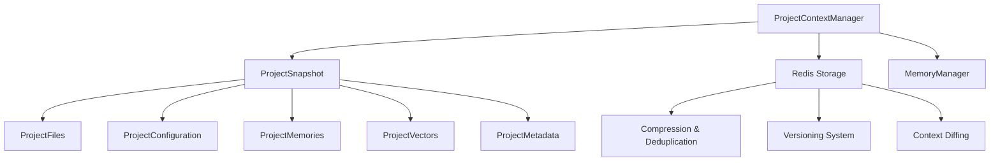

# RAG-Redis Project Context Storage and Retrieval System

## Overview

The Project Context Storage and Retrieval System is a comprehensive solution for managing complete project state including files, configurations, memories, and metadata. It provides versioning, compression, deduplication, and intelligent change tracking for AI assistant sessions.

## Architecture

### Core Components



### Data Model

#### ProjectSnapshot
The core data structure that contains:
- **ProjectFiles**: Complete file tree with content and metadata
- **ProjectConfiguration**: Build configs, environment variables, dependencies
- **ProjectMemories**: Isolated memory space with all memory types
- **ProjectVectors**: Document and code embeddings
- **ProjectMetadata**: Analytics, complexity metrics, session history

#### Storage Strategy
- **Redis Backend**: Persistent storage with connection pooling
- **Compression**: Automatic compression for content >1KB
- **Deduplication**: Content-based deduplication using SHA-256 hashes
- **Versioning**: Semantic versioning with parent-child relationships
- **Fallback**: In-memory storage when Redis unavailable

## Features

### 1. Complete State Capture
```rust
let save_options = SaveOptions {
    include_files: true,        // All project files
    include_memories: true,     // Agent memory state
    include_vectors: true,      // Embeddings and vector indices
    include_config: true,       // Build and environment configs
    compress: true,            // Automatic compression
    deduplicate: true,         // Content deduplication
    ..Default::default()
};

let snapshot_id = context_manager
    .save_project_context("my-project", &project_root, save_options)
    .await?;
```

### 2. Intelligent File Processing
- **Language Detection**: Automatic programming language identification
- **File Classification**: Config files, tests, generated files
- **Binary Support**: Handles both text and binary content
- **Path Filtering**: Configurable include/exclude patterns
- **Size Limits**: Configurable maximum file sizes

### 3. Memory Isolation
- **Project Namespaces**: Isolated memory spaces per project
- **Cross-Project References**: Maintains links between projects
- **Memory Statistics**: Usage analytics and optimization metrics
- **Type Preservation**: Maintains all memory types (Working, Short-term, Long-term, Episodic, Semantic)

### 4. Context Versioning
```rust
// Generate diff between versions
let diff = context_manager
    .diff_contexts("project-id", "v1.0.0", "v1.1.0")
    .await?;

// Diff includes:
// - File changes (added, removed, modified, renamed)
// - Memory changes (added, removed, modified)
// - Configuration changes
// - Metadata deltas
```

### 5. Session Management
```rust
// Quick save current session
let session_id = context_manager
    .quick_save_session("project-id", "Working on authentication")
    .await?;

// Quick restore session
let context = context_manager
    .quick_load_session("project-id", &session_id)
    .await?;
```

## MCP Integration

### Available Tools

| Tool | Description | Parameters |
|------|-------------|------------|
| `save_project_context` | Save complete project state | project_id, project_root, options |
| `load_project_context` | Load project state by ID | project_id, snapshot_id |
| `quick_save_session` | Quick session save | project_id, description |
| `quick_load_session` | Quick session load | project_id, session_id |
| `list_project_snapshots` | List all snapshots | project_id, limit |
| `diff_contexts` | Compare two contexts | project_id, from_version, to_version |
| `get_project_statistics` | Get project analytics | project_id |
| `cleanup_old_snapshots` | Clean up old snapshots | project_id |

### MCP Tool Examples

#### Save Project Context
```json
{
  "name": "save_project_context",
  "arguments": {
    "project_id": "my-webapp",
    "project_root": "/path/to/project",
    "options": {
      "include_files": true,
      "include_memories": true,
      "include_vectors": false,
      "compress": true,
      "description": "Before implementing auth system",
      "snapshot_type": "Milestone"
    }
  }
}
```

#### Load Project Context
```json
{
  "name": "load_project_context",
  "arguments": {
    "project_id": "my-webapp",
    "snapshot_id": "550e8400-e29b-41d4-a716-446655440000"
  }
}
```

#### Generate Context Diff
```json
{
  "name": "diff_contexts",
  "arguments": {
    "project_id": "my-webapp",
    "from_version": "1.0.0",
    "to_version": "1.1.0"
  }
}
```

## Implementation Details

### File Content Storage
```rust
pub enum FileContent {
    Text(String),                    // Direct text content
    Binary(Vec<u8>),                // Binary content
    Compressed(Vec<u8>),            // Compressed content
    Reference(String),              // External storage reference
    Deduplicated(String),           // Hash reference for deduplication
}
```

### Compression Strategy
- **Threshold**: Files >1KB automatically compressed
- **Algorithm**: Gzip compression with configurable level
- **Ratio Tracking**: Compression ratio metrics for optimization
- **Selective**: Only applied to compressible content

### Deduplication Strategy
- **Content Hashing**: SHA-256 hash of file content
- **Reference Storage**: Store hash reference instead of duplicate content
- **Savings Tracking**: Metrics on storage savings
- **Cross-File**: Deduplication across entire project

### Memory Management
```rust
pub struct ProjectMemories {
    pub project_memory_space: String,           // Namespace isolation
    pub memories_by_type: HashMap<String, Vec<MemoryEntry>>,
    pub memory_statistics: MemoryStatistics,
    pub cross_project_references: Vec<String>,
    pub memory_tags: HashSet<String>,
}
```

### Versioning System
- **Semantic Versioning**: Major.Minor.Patch format
- **Parent Tracking**: Maintains snapshot lineage
- **Branching Support**: Multiple development branches
- **Tagging**: Custom tags for important snapshots

## Performance Optimizations

### Storage Optimizations
- **Connection Pooling**: Redis connection pool with configurable size
- **Batch Operations**: Bulk operations for improved throughput
- **Lazy Loading**: Components loaded on-demand
- **Memory Caching**: Local caching for frequently accessed data

### Compression Performance
- **Streaming**: Large files processed in chunks
- **Parallel**: Multi-threaded compression for large projects
- **Adaptive**: Compression level based on content type
- **Caching**: Compressed content cached for reuse

### Memory Efficiency
- **Reference Counting**: Efficient memory usage for large projects
- **Garbage Collection**: Automatic cleanup of expired data
- **Pool Management**: Object pooling for frequent allocations
- **Lazy Decompression**: Decompress only when needed

## Configuration

### Save Options
```rust
pub struct SaveOptions {
    pub include_files: bool,                    // Include project files
    pub include_memories: bool,                 // Include agent memories
    pub include_vectors: bool,                  // Include vector embeddings
    pub include_config: bool,                   // Include configurations
    pub compress: bool,                         // Enable compression
    pub deduplicate: bool,                      // Enable deduplication
    pub file_patterns: Option<Vec<String>>,     // Include patterns
    pub exclude_patterns: Option<Vec<String>>,  // Exclude patterns
    pub max_file_size: Option<u64>,            // Maximum file size
    pub snapshot_type: SnapshotType,           // Type of snapshot
    pub description: Option<String>,           // Snapshot description
    pub tags: Vec<String>,                     // Snapshot tags
}
```

### Load Options
```rust
pub struct LoadOptions {
    pub load_files: bool,                      // Load project files
    pub load_memories: bool,                   // Load agent memories
    pub load_vectors: bool,                    // Load vector embeddings
    pub load_config: bool,                     // Load configurations
    pub target_directory: Option<PathBuf>,     // Target directory
    pub overwrite_existing: bool,              // Overwrite existing files
    pub create_backup: bool,                   // Create backup before load
    pub verify_integrity: bool,                // Verify data integrity
}
```

## Security Considerations

### Data Protection
- **Encryption**: Optional encryption for sensitive data
- **Access Control**: Project-based access control
- **Audit Logging**: Complete audit trail of operations
- **Integrity Checks**: SHA-256 validation hashes

### Credential Management
- **Environment Variables**: Credentials via environment
- **Vault Integration**: Support for external secret management
- **Rotation**: Automatic credential rotation support
- **Isolation**: Project-specific credential isolation

## Monitoring and Analytics

### Metrics Tracked
- **Storage Usage**: Per-project storage consumption
- **Compression Ratios**: Efficiency metrics
- **Access Patterns**: Frequently accessed snapshots
- **Performance**: Operation latencies and throughput
- **Error Rates**: Failure tracking and debugging

### Project Analytics
```rust
pub struct ProjectStatistics {
    pub project_id: String,
    pub total_snapshots: usize,
    pub total_storage_size: u64,
    pub oldest_snapshot: Option<DateTime<Utc>>,
    pub newest_snapshot: Option<DateTime<Utc>>,
    pub snapshot_types: HashMap<String, usize>,
    pub storage_trend: Vec<(DateTime<Utc>, u64)>,
    pub complexity_trend: Vec<(DateTime<Utc>, u32)>,
    pub activity_trend: Vec<(DateTime<Utc>, u32)>,
}
```

## Error Handling

### Error Types
- **Storage Errors**: Redis connectivity and operations
- **Serialization Errors**: JSON/binary serialization failures
- **Compression Errors**: Compression/decompression failures
- **Validation Errors**: Data integrity and format validation
- **Permission Errors**: File system access issues

### Recovery Strategies
- **Automatic Retry**: Configurable retry logic with backoff
- **Fallback Storage**: In-memory fallback when Redis unavailable
- **Partial Recovery**: Recover what's possible from corrupted data
- **Graceful Degradation**: Continue operation with reduced functionality

## Usage Examples

### Basic Project Context Save/Load
```rust
use rag_redis_system::{RagSystem, Config, project_context::SaveOptions};

let rag_system = RagSystem::new(Config::default()).await?;
let project_root = std::path::PathBuf::from("/path/to/project");

// Save project context
let snapshot_id = rag_system
    .handle_save_project_context(
        "my-project".to_string(),
        Some(project_root.to_string_lossy().to_string()),
        Some(serde_json::to_value(SaveOptions::default())?),
    )
    .await?;

// Load project context
let context = rag_system
    .handle_load_project_context("my-project".to_string(), Some(snapshot_id))
    .await?;
```

### Session Management
```rust
// Save current session
let session_id = rag_system
    .handle_quick_save_session(
        "my-project".to_string(),
        "Working on user authentication".to_string(),
    )
    .await?;

// Load session later
let session_context = rag_system
    .handle_quick_load_session("my-project".to_string(), session_id)
    .await?;
```

### Change Tracking
```rust
// Get list of snapshots
let snapshots = rag_system
    .handle_list_project_snapshots("my-project".to_string(), Some(10))
    .await?;

// Generate diff between versions
let diff = rag_system
    .handle_diff_contexts(
        "my-project".to_string(),
        "1.0.0".to_string(),
        "1.1.0".to_string(),
    )
    .await?;
```

## Best Practices

### Project Organization
1. **Namespace Projects**: Use clear, consistent project IDs
2. **Regular Snapshots**: Create snapshots at logical milestones
3. **Descriptive Names**: Use meaningful snapshot descriptions
4. **Tag Important Versions**: Tag releases and major milestones
5. **Clean Up Regularly**: Remove old, unnecessary snapshots

### Performance Optimization
1. **Selective Inclusion**: Only include necessary components
2. **Exclude Large Files**: Use exclude patterns for build artifacts
3. **Compress When Possible**: Enable compression for storage efficiency
4. **Batch Operations**: Group multiple operations when possible
5. **Monitor Usage**: Track storage and performance metrics

### Security
1. **Sensitive Data**: Exclude sensitive files from snapshots
2. **Access Control**: Implement project-based access controls
3. **Encryption**: Enable encryption for sensitive projects
4. **Audit Trails**: Monitor and log all context operations
5. **Regular Cleanup**: Remove old snapshots containing sensitive data

## Troubleshooting

### Common Issues

#### Redis Connection Problems
```bash
# Check Redis connectivity
redis-cli -p 6380 ping

# Monitor Redis operations
redis-cli -p 6380 monitor
```

#### Storage Issues
```rust
// Check project statistics
let stats = rag_system
    .handle_get_project_statistics("project-id".to_string())
    .await?;
```

#### Memory Issues
```rust
// Enable memory-optimized build
cargo build --profile release-memory-optimized
```

#### Performance Issues
```rust
// Use selective loading
let load_options = LoadOptions {
    load_vectors: false,  // Skip vectors for faster loading
    verify_integrity: false,  // Skip verification for speed
    ..Default::default()
};
```

## Future Enhancements

### Planned Features
1. **Distributed Storage**: Multi-node Redis cluster support
2. **Advanced Compression**: Context-aware compression algorithms
3. **ML-Based Optimization**: AI-driven storage optimization
4. **Real-time Sync**: Live synchronization between instances
5. **Cloud Integration**: Support for cloud storage backends

### Research Areas
1. **Incremental Snapshots**: Delta-based storage for efficiency
2. **Semantic Diffing**: Understanding code changes semantically
3. **Predictive Caching**: ML-based cache optimization
4. **Automated Cleanup**: AI-driven retention policies
5. **Cross-Project Analysis**: Project relationship discovery

---

## Getting Started

To get started with the Project Context System:

1. **Install Dependencies**: Ensure Redis is running
2. **Initialize System**: Create a `RagSystem` instance
3. **Save First Snapshot**: Create your first project snapshot
4. **Explore Features**: Try session management and diffing
5. **Integrate with MCP**: Use the MCP tools in your AI assistant

For detailed examples, see the `examples/` directory in the repository.