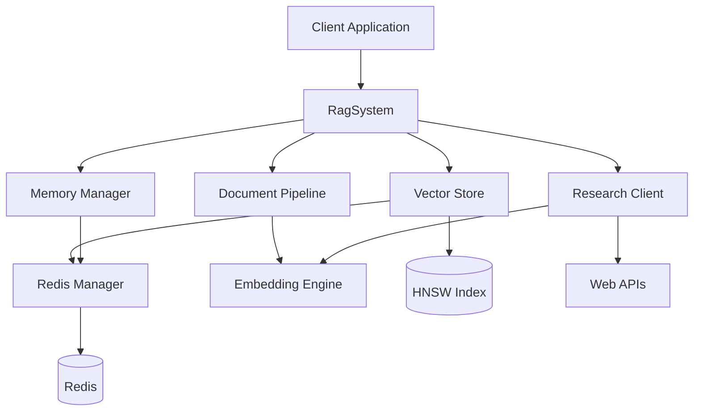

# RAG-Redis System Architecture

## Table of Contents

1. [Executive Summary](#executive-summary)
2. [System Overview](#system-overview)
3. [Core Architecture](#core-architecture)
4. [Component Design](#component-design)
5. [Data Flow](#data-flow)
6. [Design Decisions](#design-decisions)
7. [Performance Architecture](#performance-architecture)
8. [Security Architecture](#security-architecture)
9. [Deployment Architecture](#deployment-architecture)
10. [Future Architecture](#future-architecture)

## Executive Summary

The RAG-Redis System is a high-performance Retrieval-Augmented Generation system designed for production environments requiring low-latency vector search, scalable document storage, and seamless integration with existing infrastructure. Built with Rust for performance and safety, it provides both native and FFI interfaces for maximum flexibility.

### Key Architectural Principles

- **Performance First**: SIMD optimizations, lock-free data structures, zero-copy operations
- **Scalability**: Horizontal scaling via Redis cluster, distributed vector indices
- **Reliability**: Comprehensive error handling, retry mechanisms, circuit breakers
- **Extensibility**: Plugin architecture for embeddings, indices, and storage backends
- **Safety**: Memory-safe Rust, validated FFI boundaries, type-safe configurations

## System Overview

```
┌─────────────────────────────────────────────────────────────────┐
│                         Client Applications                      │
│  (Rust Native, C/C++ via FFI, Python via MCP, REST API)        │
└─────────────┬───────────────────────────────────┬───────────────┘
              │                                   │
              ▼                                   ▼
┌─────────────────────────┐         ┌─────────────────────────┐
│    RAG System Core      │         │      FFI Layer          │
│  ┌─────────────────┐    │         │  ┌─────────────────┐   │
│  │ Document Pipeline│    │         │  │  C API Bridge   │   │
│  └─────────────────┘    │         │  └─────────────────┘   │
│  ┌─────────────────┐    │         │  ┌─────────────────┐   │
│  │  Vector Store   │    │◄────────►│  │  C++ Wrapper    │   │
│  └─────────────────┘    │         │  └─────────────────┘   │
│  ┌─────────────────┐    │         └─────────────────────────┘
│  │ Memory Manager  │    │
│  └─────────────────┘    │
│  ┌─────────────────┐    │
│  │ Research Client │    │
│  └─────────────────┘    │
└──────────┬──────────────┘
           │
           ▼
┌─────────────────────────────────────────────────────────────────┐
│                         Storage Layer                            │
│  ┌──────────────┐  ┌──────────────┐  ┌──────────────┐         │
│  │    Redis     │  │  Vector DB   │  │  Object Store│         │
│  │   Cluster    │  │    (HNSW)    │  │     (S3)     │         │
│  └──────────────┘  └──────────────┘  └──────────────┘         │
└─────────────────────────────────────────────────────────────────┘
```

## Core Architecture

### 1. Layered Architecture

The system follows a clean layered architecture with clear separation of concerns:

```
┌─────────────────────────────────────────┐
│         Presentation Layer               │
│   (FFI, REST API, MCP Server)           │
├─────────────────────────────────────────┤
│         Application Layer                │
│   (RagSystem, Orchestration)            │
├─────────────────────────────────────────┤
│         Domain Layer                     │
│   (Document, Vector, Memory)            │
├─────────────────────────────────────────┤
│         Infrastructure Layer             │
│   (Redis, HNSW, Embeddings)             │
└─────────────────────────────────────────┘
```

### 2. Component Interactions



### 3. Async Runtime Architecture

The system uses Tokio for async operations with the following runtime configuration:

```rust
pub struct RuntimeConfig {
    worker_threads: usize,      // CPU cores * 2
    blocking_threads: usize,    // 512
    thread_stack_size: usize,   // 2MB
    enable_io: bool,           // true
    enable_time: bool,         // true
}
```

## Component Design

### 1. RagSystem (Core Orchestrator)

**Responsibilities:**
- System initialization and configuration
- Request routing and orchestration
- Resource lifecycle management
- Cross-component coordination

**Design Pattern:** Facade Pattern with Dependency Injection

```rust
pub struct RagSystem {
    config: Arc<Config>,
    redis_manager: Arc<RedisManager>,
    vector_store: Arc<RwLock<VectorStore>>,
    document_pipeline: Arc<DocumentPipeline>,
    memory_manager: Arc<MemoryManager>,
    research_client: Arc<ResearchClient>,
    metrics: Arc<MetricsCollector>,
}
```

### 2. Document Pipeline

**Responsibilities:**
- Document ingestion and normalization
- Intelligent text chunking
- Metadata extraction
- Format conversion (PDF, HTML, Markdown)

**Processing Pipeline:**

```
Input Document
    │
    ▼
┌─────────────┐
│  Parser     │ ─► Format Detection
└─────────────┘    (PDF/HTML/MD/TXT)
    │
    ▼
┌─────────────┐
│  Extractor  │ ─► Metadata Extraction
└─────────────┘    (Title, Author, Date)
    │
    ▼
┌─────────────┐
│  Chunker    │ ─► Smart Chunking
└─────────────┘    (Semantic boundaries)
    │
    ▼
┌─────────────┐
│  Enricher   │ ─► Add context
└─────────────┘    (Headers, sections)
    │
    ▼
Output Chunks
```

**Chunking Strategy:**

```rust
pub struct ChunkingConfig {
    strategy: ChunkingStrategy,
    max_chunk_size: usize,      // 512 tokens
    min_chunk_size: usize,      // 100 tokens
    overlap_size: usize,        // 50 tokens
    respect_boundaries: bool,   // true
    boundary_markers: Vec<String>,
}

pub enum ChunkingStrategy {
    FixedSize,
    Semantic,       // Respects sentence/paragraph boundaries
    Sliding,        // Overlapping windows
    Hierarchical,   // Maintains document structure
}
```

### 3. Vector Store

**Responsibilities:**
- Vector indexing and storage
- Similarity search operations
- Index persistence and recovery
- Metadata filtering

**Architecture:**

```rust
pub struct VectorStore {
    index: Box<dyn VectorIndex>,
    metadata_store: DashMap<String, VectorMetadata>,
    dimension: usize,
    distance_metric: DistanceMetric,
    stats: Arc<VectorStoreStats>,
}

pub trait VectorIndex: Send + Sync {
    fn add(&mut self, id: &str, vector: &[f32]) -> Result<()>;
    fn search(&self, query: &[f32], k: usize) -> Result<Vec<SearchResult>>;
    fn remove(&mut self, id: &str) -> Result<()>;
    fn persist(&self, path: &Path) -> Result<()>;
    fn load(path: &Path) -> Result<Self>;
}
```

**HNSW Index Configuration:**

```rust
pub struct HnswConfig {
    m: usize,                    // 16 - Number of bi-directional links
    ef_construction: usize,      // 200 - Size of dynamic candidate list
    ef_search: usize,           // 50 - Size of search candidate list
    max_elements: usize,        // 1_000_000
    seed: u64,                  // Random seed for reproducibility
    extend_candidates: bool,    // true
    keep_pruned_connections: bool, // false
}
```

### 4. Redis Backend

**Responsibilities:**
- Document and chunk storage
- Distributed caching
- Session management
- Pub/Sub messaging

**Storage Schema:**

```
Documents:
  doc:{doc_id} → Document JSON
  doc:chunks:{doc_id} → Set of chunk IDs
  doc:meta:{doc_id} → Document metadata

Chunks:
  chunk:{chunk_id} → Chunk content
  chunk:vec:{chunk_id} → Vector embedding
  chunk:meta:{chunk_id} → Chunk metadata

Indices:
  idx:docs → Sorted set of document IDs by timestamp
  idx:chunks:{doc_id} → Sorted set of chunks by position

Cache:
  cache:emb:{text_hash} → Cached embedding
  cache:search:{query_hash} → Cached search results
```

**Connection Pool Architecture:**

```rust
pub struct RedisManager {
    pool: Pool<RedisConnectionManager>,
    cluster_client: Option<ClusterClient>,
    pubsub_conn: Option<PubSubConnection>,
    config: RedisConfig,
}

pub struct RedisConfig {
    url: String,
    pool_size: u32,              // 10
    max_lifetime: Duration,      // 30 minutes
    idle_timeout: Duration,      // 10 minutes
    connection_timeout: Duration, // 5 seconds
    enable_cluster: bool,
    retry_policy: RetryPolicy,
}
```

### 5. Memory Manager

**Responsibilities:**
- Cache management (L1/L2/L3)
- Memory pressure monitoring
- Eviction policies
- Buffer management

**Memory Hierarchy:**

```
┌─────────────────┐
│   L1 Cache      │ ← In-process LRU (100MB)
│   (DashMap)     │   ~1μs access
└────────┬────────┘
         │
┌────────▼────────┐
│   L2 Cache      │ ← Redis local (1GB)
│   (Redis)       │   ~100μs access
└────────┬────────┘
         │
┌────────▼────────┐
│   L3 Storage    │ ← Redis cluster/S3
│   (Persistent)  │   ~10ms access
└─────────────────┘
```

**Cache Strategy:**

```rust
pub struct CacheConfig {
    l1_size: usize,             // 100MB
    l2_size: usize,             // 1GB
    ttl: Duration,              // 1 hour
    eviction_policy: EvictionPolicy,
    compression: bool,          // true for L2/L3
}

pub enum EvictionPolicy {
    LRU,    // Least Recently Used
    LFU,    // Least Frequently Used
    FIFO,   // First In First Out
    ARC,    // Adaptive Replacement Cache
}
```

### 6. Embedding Engine

**Responsibilities:**
- Text to vector conversion
- Model management
- Batch processing
- Fallback strategies

**Provider Architecture:**

```rust
pub trait EmbeddingProvider: Send + Sync {
    async fn embed(&self, text: &str) -> Result<Vec<f32>>;
    async fn embed_batch(&self, texts: &[String]) -> Result<Vec<Vec<f32>>>;
    fn dimension(&self) -> usize;
    fn max_tokens(&self) -> usize;
}

pub enum EmbeddingModel {
    OpenAI(OpenAIProvider),
    Local(LocalProvider),      // ONNX/Candle
    Cohere(CohereProvider),
    Custom(Box<dyn EmbeddingProvider>),
}
```

**Batching Strategy:**

```rust
pub struct BatchProcessor {
    batch_size: usize,          // 100
    max_wait: Duration,         // 100ms
    max_retries: usize,        // 3
    backoff: ExponentialBackoff,
}
```

## Data Flow

### 1. Document Ingestion Flow

```
Client Request
    │
    ▼
[Validate Input]
    │
    ▼
[Parse Document] ──────► [Extract Metadata]
    │                           │
    ▼                           ▼
[Chunk Text] ◄───────── [Store Metadata]
    │
    ▼
[Generate Embeddings] ← Batch Process
    │
    ├──► [Store in Vector Index]
    │
    ├──► [Store in Redis]
    │
    └──► [Update Cache]

Return Document ID
```

### 2. Search Flow

```
Search Query
    │
    ▼
[Check Cache] ────► HIT ────► Return Results
    │
    │ MISS
    ▼
[Generate Query Embedding]
    │
    ▼
[Vector Similarity Search]
    │
    ├──► [HNSW Index Search]
    │
    ├──► [Metadata Filtering]
    │
    └──► [Score Reranking]
    │
    ▼
[Fetch Documents from Redis]
    │
    ▼
[Post-process Results]
    │
    ├──► [Add Context]
    │
    ├──► [Highlight Matches]
    │
    └──► [Update Cache]

Return Search Results
```

### 3. Research Flow

```
Research Query
    │
    ├──► [Local Search]
    │         │
    │         ▼
    │    [Vector Search]
    │
    └──► [Web Search]
              │
              ├──► [Query Expansion]
              │
              ├──► [Source Selection]
              │
              └──► [Parallel Fetching]
                        │
                        ▼
                   [Content Extraction]
                        │
                        ▼
                   [Generate Embeddings]

    [Merge Results]
         │
         ▼
    [Deduplication]
         │
         ▼
    [Reranking]
         │
         ▼
    Return Combined Results
```

## Design Decisions

### 1. Why Rust?

**Performance:**
- Zero-cost abstractions
- No garbage collection overhead
- SIMD optimizations
- Efficient memory usage

**Safety:**
- Memory safety without GC
- Thread safety guarantees
- Type safety
- No null pointer exceptions

**Ecosystem:**
- Excellent async runtime (Tokio)
- Rich library ecosystem
- Great FFI support
- Active community

### 2. Why Redis?

**Scalability:**
- Horizontal scaling via clustering
- Master-slave replication
- Automatic sharding

**Performance:**
- In-memory operations
- Optimized data structures
- Pipelining support
- Lua scripting

**Features:**
- Persistence options
- Pub/Sub messaging
- Transactions
- TTL support

### 3. Why HNSW?

**Performance:**
- O(log n) search complexity
- Excellent recall rates
- Tunable accuracy/speed tradeoff

**Memory Efficiency:**
- Compact graph structure
- Incremental index building
- No need to rebuild for updates

**Production Ready:**
- Battle-tested algorithm
- Used by major systems
- Well-understood characteristics

### 4. Architecture Patterns

**Dependency Injection:**
- Testability
- Flexibility
- Loose coupling

**Arc<T> for Shared State:**
- Thread-safe sharing
- Minimal overhead
- Clear ownership

**Async/Await:**
- Non-blocking I/O
- Efficient resource usage
- Natural error propagation

**Result<T, E> for Error Handling:**
- Explicit error handling
- Type-safe errors
- Composable error chains

## Performance Architecture

### 1. SIMD Optimizations

```rust
#[cfg(target_arch = "x86_64")]
use std::arch::x86_64::*;

pub fn cosine_similarity_simd(a: &[f32], b: &[f32]) -> f32 {
    unsafe {
        let mut dot = _mm256_setzero_ps();
        let mut norm_a = _mm256_setzero_ps();
        let mut norm_b = _mm256_setzero_ps();

        for i in (0..a.len()).step_by(8) {
            let va = _mm256_loadu_ps(a.as_ptr().add(i));
            let vb = _mm256_loadu_ps(b.as_ptr().add(i));

            dot = _mm256_fmadd_ps(va, vb, dot);
            norm_a = _mm256_fmadd_ps(va, va, norm_a);
            norm_b = _mm256_fmadd_ps(vb, vb, norm_b);
        }

        // Horizontal sum and final calculation
        // ...
    }
}
```

### 2. Memory Layout Optimization

```rust
// Cache-line aligned structures
#[repr(align(64))]
pub struct VectorData {
    pub id: [u8; 16],      // UUID
    pub vector: Vec<f32>,   // Aligned vector data
    pub metadata: Metadata, // Hot data together
}

// Structure of Arrays for better vectorization
pub struct VectorBatch {
    pub ids: Vec<[u8; 16]>,
    pub vectors: Vec<f32>,  // Contiguous memory
    pub dimensions: usize,
}
```

### 3. Concurrency Model

```rust
pub struct ConcurrencyConfig {
    // CPU-bound work
    compute_threads: usize,     // CPU cores

    // I/O-bound work
    io_threads: usize,          // CPU cores * 2

    // Background tasks
    background_threads: usize,  // 4

    // Thread pool sizes
    search_pool_size: usize,    // 16
    index_pool_size: usize,     // 8
}
```

### 4. Batching and Pipelining

```rust
pub struct BatchConfig {
    // Embedding batching
    embedding_batch_size: usize,     // 100
    embedding_max_wait: Duration,    // 100ms

    // Redis pipelining
    redis_pipeline_size: usize,      // 1000
    redis_flush_interval: Duration,  // 10ms

    // Vector index batching
    index_batch_size: usize,         // 500
    index_commit_interval: Duration, // 1s
}
```

## Security Architecture

### 1. Authentication & Authorization

```rust
pub struct SecurityConfig {
    auth_enabled: bool,
    auth_provider: AuthProvider,
    tls_enabled: bool,
    tls_config: TlsConfig,
}

pub enum AuthProvider {
    JWT(JwtConfig),
    OAuth2(OAuth2Config),
    ApiKey(ApiKeyConfig),
    Custom(Box<dyn Authenticator>),
}
```

### 2. Data Protection

**Encryption at Rest:**
- Redis persistence encryption
- Vector index encryption
- Configuration encryption

**Encryption in Transit:**
- TLS 1.3 for all connections
- Certificate pinning
- Mutual TLS support

### 3. Input Validation

```rust
pub struct ValidationConfig {
    max_document_size: usize,      // 10MB
    max_query_length: usize,        // 1000 chars
    allowed_mime_types: Vec<String>,
    sanitize_html: bool,           // true
    scan_for_malware: bool,        // false
}
```

### 4. Rate Limiting

```rust
pub struct RateLimitConfig {
    requests_per_second: u32,      // 100
    burst_size: u32,               // 200
    window_size: Duration,         // 1 minute
    strategy: RateLimitStrategy,
}

pub enum RateLimitStrategy {
    TokenBucket,
    SlidingWindow,
    FixedWindow,
    LeakyBucket,
}
```

## Deployment Architecture

### 1. Container Architecture

```dockerfile
# Multi-stage build
FROM rust:1.75 as builder
WORKDIR /app
COPY . .
RUN cargo build --release --features "gpu,metrics"

FROM debian:bookworm-slim
RUN apt-get update && apt-get install -y \
    ca-certificates \
    libssl3 \
    && rm -rf /var/lib/apt/lists/*

COPY --from=builder /app/target/release/rag-redis-server /usr/local/bin/
EXPOSE 8080
CMD ["rag-redis-server"]
```

### 2. Kubernetes Deployment

```yaml
apiVersion: apps/v1
kind: Deployment
metadata:
  name: rag-redis-system
spec:
  replicas: 3
  selector:
    matchLabels:
      app: rag-redis
  template:
    metadata:
      labels:
        app: rag-redis
    spec:
      containers:
      - name: rag-redis
        image: rag-redis:latest
        resources:
          requests:
            memory: "2Gi"
            cpu: "1000m"
          limits:
            memory: "4Gi"
            cpu: "2000m"
        env:
        - name: REDIS_URL
          valueFrom:
            secretKeyRef:
              name: redis-secret
              key: url
```

### 3. Horizontal Scaling

```
                    Load Balancer
                         │
            ┌────────────┼────────────┐
            │            │            │
        RAG Node 1   RAG Node 2   RAG Node 3
            │            │            │
            └────────────┼────────────┘
                         │
                 Shared Storage Layer
                         │
            ┌────────────┼────────────┐
            │            │            │
        Redis-1      Redis-2      Redis-3
        (Master)     (Slave)      (Slave)
```

### 4. High Availability

**Component Redundancy:**
- Multiple RAG system instances
- Redis cluster with replication
- Load balancer failover
- Backup embedding providers

**Failure Handling:**
- Circuit breakers
- Retry with exponential backoff
- Fallback strategies
- Graceful degradation

## Future Architecture

### 1. Planned Enhancements

**GPU Acceleration:**
- CUDA kernels for vector operations
- GPU-based HNSW implementation
- Batch embedding on GPU
- Multi-GPU support

**Distributed Processing:**
- Distributed vector index
- Federated search
- Cross-datacenter replication
- Edge deployment support

**Advanced Features:**
- Streaming ingestion
- Real-time index updates
- Incremental learning
- Active learning loops

### 2. Scalability Roadmap

**Phase 1: Current (1M vectors)**
- Single node deployment
- Local Redis instance
- In-memory index

**Phase 2: Medium Scale (10M vectors)**
- Multi-node deployment
- Redis cluster
- Distributed index

**Phase 3: Large Scale (100M+ vectors)**
- Kubernetes orchestration
- Sharded indices
- Tiered storage
- Global distribution

### 3. Integration Roadmap

**MCP Server:**
- Full MCP protocol implementation
- Tool registration
- Resource management
- Event streaming

**LLM Integration:**
- OpenAI compatible API
- Anthropic Claude support
- Local model support
- Custom model adapters

**Monitoring & Observability:**
- Prometheus metrics
- OpenTelemetry tracing
- Grafana dashboards
- Alert manager integration

## Conclusion

The RAG-Redis System architecture is designed for production environments requiring high performance, scalability, and reliability. The modular design allows for easy extension and customization while maintaining clean separation of concerns. The use of Rust provides memory safety and performance, while the Redis backend ensures scalability and persistence.

Key architectural strengths:
- **Performance**: SIMD optimizations, efficient memory layout, async I/O
- **Scalability**: Horizontal scaling, distributed storage, load balancing
- **Reliability**: Comprehensive error handling, retry mechanisms, failover
- **Extensibility**: Plugin architecture, clean interfaces, dependency injection
- **Maintainability**: Clear separation of concerns, type safety, documentation

The architecture is ready for production deployment while providing clear paths for future enhancement and scaling.
