# RAG-Redis System Architecture Diagrams

## 1. Current Architecture (BEFORE)
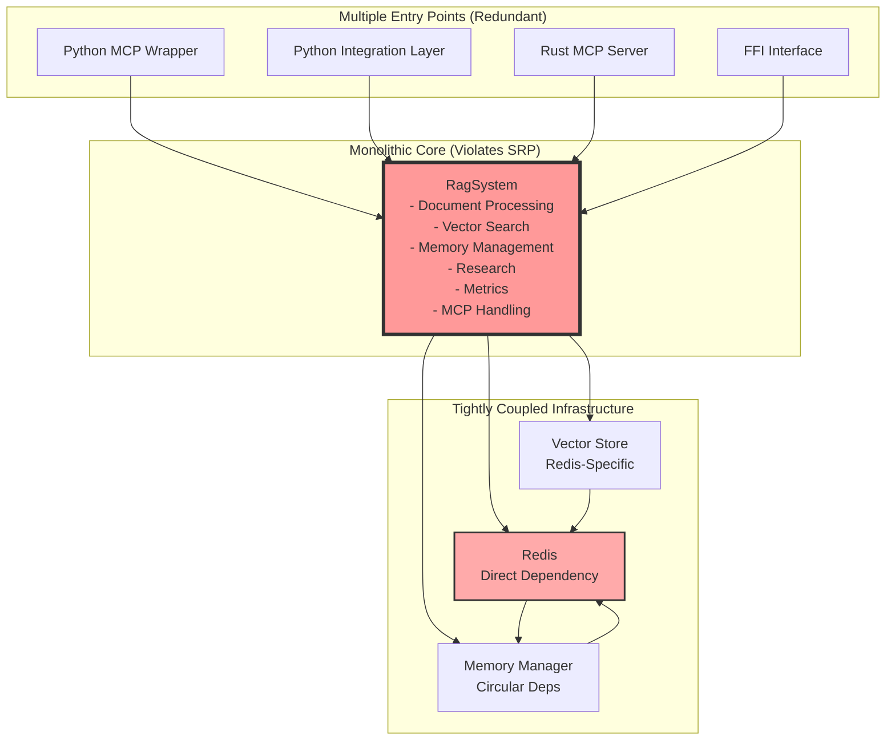

## 2. Proposed Clean Architecture (AFTER)
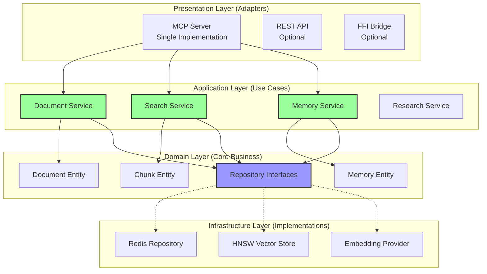

## 3. Dependency Flow Comparison

### Before (Circular Dependencies)
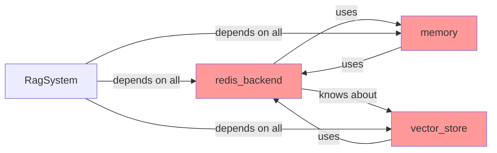

### After (Clean Dependencies)
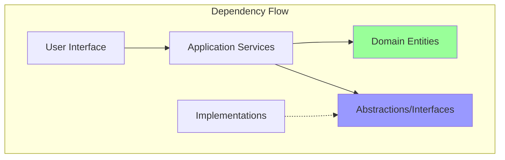

## 4. Data Flow Architecture

### Document Ingestion Flow
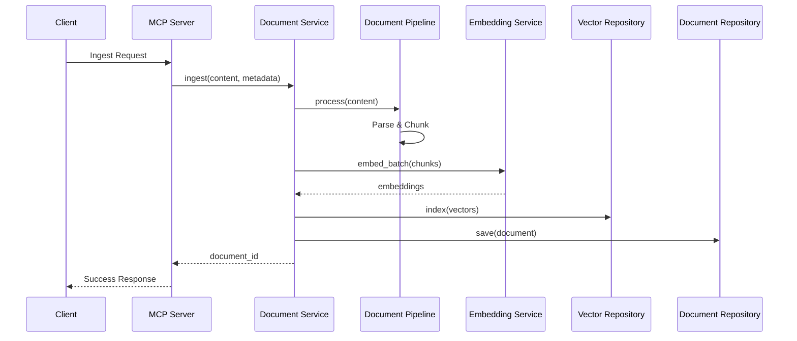

### Search Flow
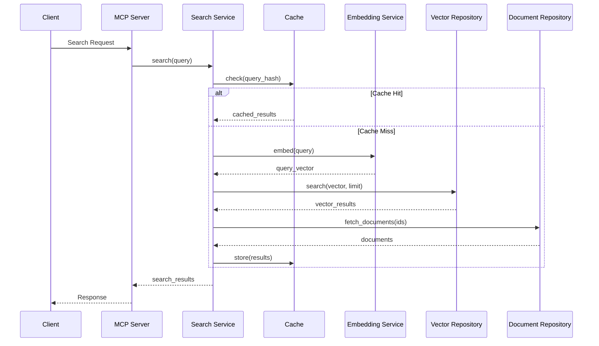

## 5. Module Organization

### Before (Mixed Concerns)
```
rag-redis-system/
├── src/
│   ├── lib.rs                 ❌ Everything mixed
│   ├── memory_profiler.rs     ❌ Observability in core
│   ├── memory_dashboard.rs    ❌ UI in core
│   ├── vector_store.rs        ❌ Infrastructure details
│   └── redis_backend.rs       ❌ Direct coupling
```

### After (Clean Separation)
```
rag-redis-system/
├── core/                      ✓ Pure domain logic
│   ├── domain/
│   │   ├── document.rs
│   │   ├── chunk.rs
│   │   └── memory.rs
│   ├── repositories/          ✓ Abstractions only
│   │   └── mod.rs
│   └── services/              ✓ Use cases
│       ├── document_service.rs
│       └── search_service.rs
├── infrastructure/            ✓ Implementation details
│   ├── redis/
│   ├── embedding/
│   └── storage/
├── interfaces/                ✓ External interfaces
│   └── mcp/
└── observability/            ✓ Separate crate
    ├── profiler/
    └── dashboard/
```

## 6. Service Interaction Patterns

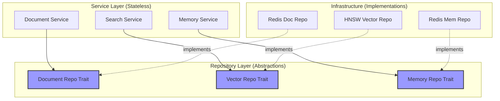

## 7. Deployment Architecture

### Containerized Deployment
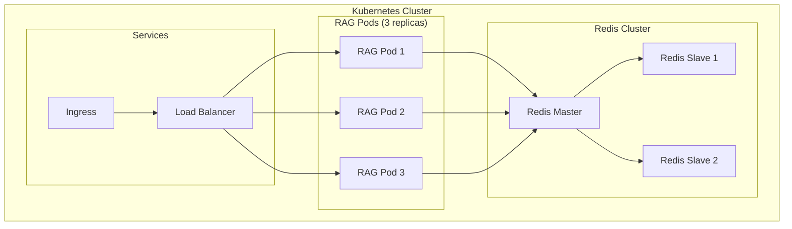

## 8. Error Handling Flow
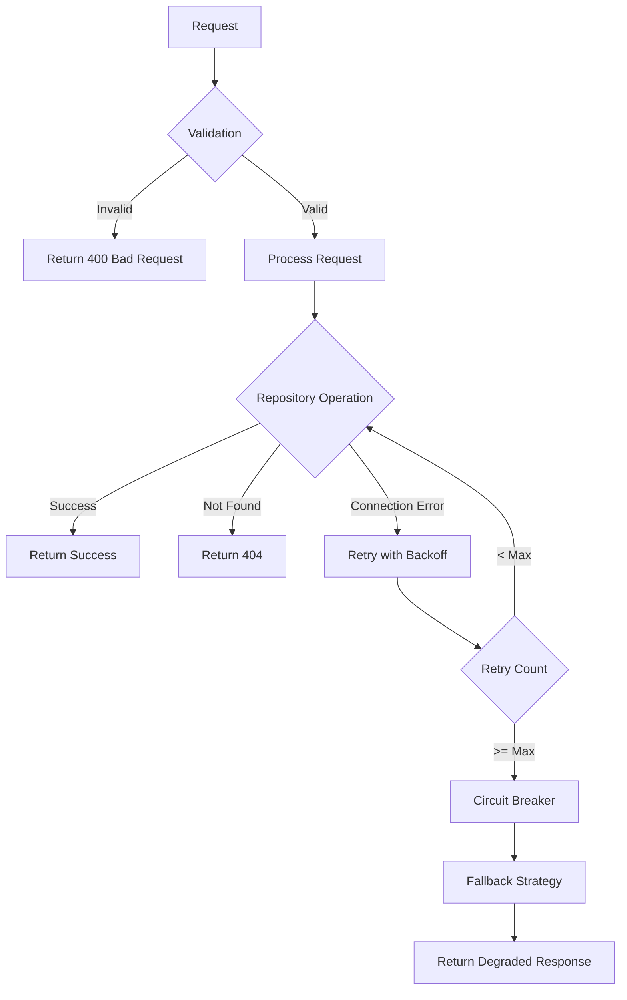

## 9. Memory Management Architecture
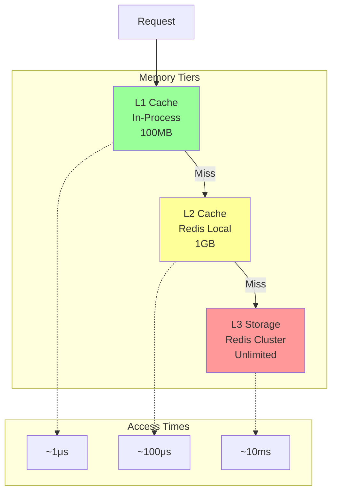

## 10. Security Architecture
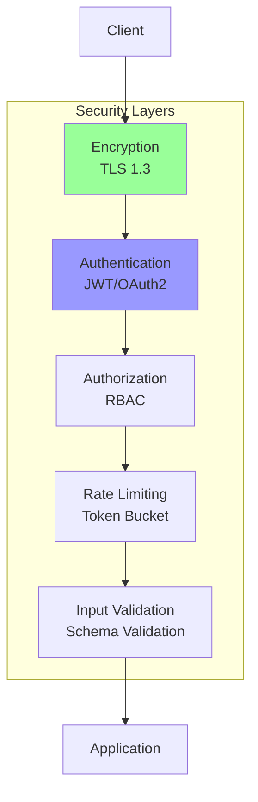

## Summary

The architectural diagrams illustrate the transformation from a monolithic, tightly-coupled system with multiple redundant entry points to a clean, layered architecture following SOLID principles and hexagonal architecture patterns. Key improvements include:

1. **Single entry point** through consolidated MCP server
2. **Clear separation of concerns** with focused services
3. **Dependency inversion** through repository abstractions
4. **Elimination of circular dependencies**
5. **Proper layering** with unidirectional dependencies
6. **Testability** through interface-based design
7. **Scalability** through stateless services
8. **Maintainability** through modular structure
